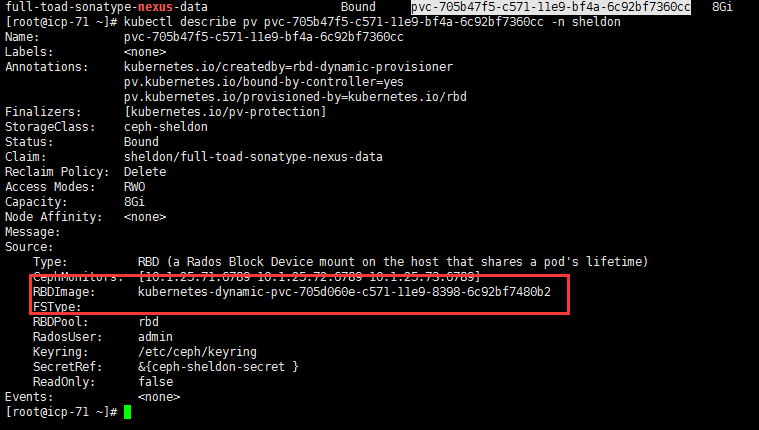

准备：

- docker image: sonatype/nexus3:3.16.1

- docker image: zhixiangxiao/docker-nexus-backup:1.2.0

-  nexus的备份数据（之前传到过一台备份机器）

-  values.yaml需要修改的数据：value.persistence.storageClass  value.nexusBackup.persistence.storageClass

## 安装nexus：

```shell
helm install ./sonatype-nexus --<namespace>
```

1. 查看nexus的pv，找出image映射的挂载
```shell
kubectl get pvc -n <namespace> | grep nexus（查看nexus存储的pvc）
```

```
kubectl describe pv <pvname> -n <namespace> 查看pv绑定的RBDImage
```


查看pod所在的机器：
```
kubectl get po -n <namespace> -o wide
```
进入pod所在的机器，查看rbd image所映射的挂载：
```
rbd showmapped | grep <rbdimage>     
```
找到对应的挂载设备，此处是/dev/rbd1


```
df -h /dev/rbd0(上一步找到的挂载设备) 可以得到实际挂载路径。
```


2. 删除目录下所有文件，将备份的数据文件解压后放到该目录下，注意是将nexus-data目录下文件，不包括nexus-data文件，即只改变当前文件内容，不改变目录结构将nexus的备份数据解压。

3. 删除nexus的pod，让pod自行重启。

4. 如果新的pod没有在原来的pod所在的node机器上面，则需要将rbd解绑，如果是同一台机器，安装完毕。

5. 解绑

   ```
   kubectl describe pod  //查看是否需要解绑
   ```
6. 如果提示pod挂载的images有问题，则需要到原来的pod所在机器，执行第2步中查看rbdimage的操作，同时解绑/dev/rbd1：
    ```
   umount /dev/rbd1 
    ```
7. 解绑后pod即可创建成功。