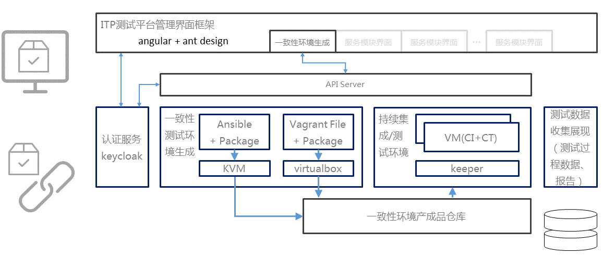

# CD-BCI-BP-BM-L4-01-服务化构建系统相关文档

<table border="0" bordercolor="#FFFFFF">
  <tr>
    <th></th>
    <th><h1 style="font-size:150%">能力项  [构建实践]</h1></th>
  </tr>
</table>

# 简介

构建服务为开发者提供配置构建平台，实现构建云服务化，实现持续交付并缩短交付周期，提升交付效率。支持编译构建任务代码化描述，自动化的创建、配置和执行，更加快速、高效地执行编译构建服务。

# 技术路线

在最贱实践中采用的是虚拟机持续构建服务。

在构建服务中使用虚机和容器是两种不同的技术路线，它们各有优缺点:

|技术路线|虚拟机|容器|备注|
|-----|-----|-----|-----|
|运行速度|因为存在Hypervisor层，指令转换有一定开销，速度较慢。|直接调用kernel，速度较快。|   |
|业务隔离|隔离性好|利用CGroup和namespace隔离，隔离性较好|  |
|状态恢复|恢复完全，速度慢|恢复完全，速度快|  |
|管理开销|复杂，开销比较大|较简单，开销小|  |
|存储|方案简单|方案较复杂|  |
|容器构建|支持容器构建|比较复杂|现阶段容器内构建容器的解决方案不完善，存在性能或安全问题。 |
|开发环境一致性|方案简单|方案较复杂|现阶段在云端开发中较容易实现全容器开发。 |

# 最佳实践

*一致性测试环境生成：通过代码化脚本生成集成和测试服务虚拟机，保证开发测试环境的一致性
*环境产成品仓库：按不同功能标签存储多种定义好的一致性虚机环境，项目按需使用
*持续集成/测试环境：按照不同的需求动态调度持续集成/测试虚机执行代码化的集成或测试脚本，支持并行，提升资源利用率；并负责虚机销毁和重置
*提供完善的API服务，方便调用和第三方服务集成  

# 相关项目
虚拟机构建环境调度  
https://github.com/inspursoft/keeper  
  
虚拟机构建相关项目
KVM, Ansible,
VirtualBox, Vagrant,
(管理集成项目待开源)  
