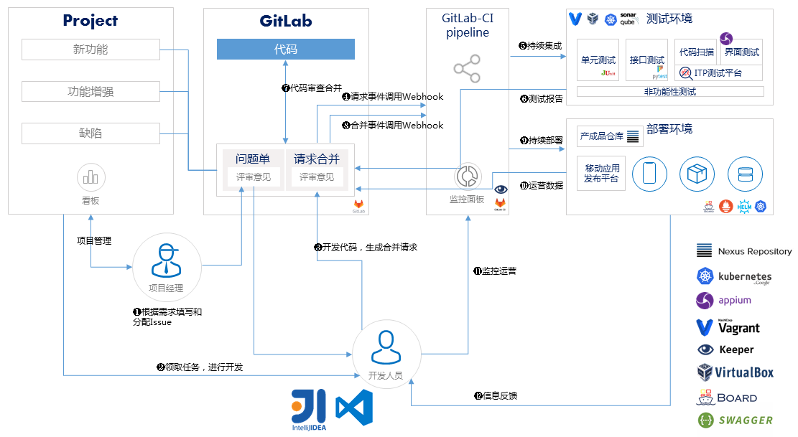

# CD-BCI-CI-IM-L4-01-持续集成方案设计文档

<table border="0" bordercolor="#FFFFFF">
  <tr>
    <th></th>
    <th><h1 style="font-size:150%">能力项  [持续集成]</h1></th>
  </tr>
</table>

# 简介

> 本文主要介绍了持续集成的流程。

# 前言

 持续集成是一种软件开发实践，即团队开发成员经常集成他们的工作，通常每个成员每天至少集成一次，也就意味着每天可能会发生多次集成。每次集成都通过自动化的构建（包括编译，发布，自动化测试)来验证，从而尽快地发现集成错误。许多团队发现这个过程可以大大减少集成的问题，让团队能够更快的开发内聚的软件。

 

# 目的

 软件集成是软件开发过程中的一个环节，这个环节的工作一般会包括以下流程：合并代码---->安装依赖---->编译---->测试---->发布。软件集成的工作一般会比较细碎繁琐，为了不影响开发效率，以前软件集成这个环节一般不会经常进行或者只会等到项目后期再进行。但是有些问题，如果等到后期才发现，解决问题的代价很大，有可能导致项目延期或者失败。因此，为了尽早发现软件集成错误，鼓励团队成员应该经常集成他们的工作，通常每个成员每天应该至少集成一次。软件集成的工作细碎繁琐，以前是由人工完成的。现在鼓励持续集成，将软件集成这个工作自动化，也就是持续集成系统。

GitLab-CI 就是一套配合 GitLab 使用的持续集成系统，GitLab 集成了 GitLab-CI 并且默认启用。GitLab-Runner 是配合 GitLab-CI 进行使用。GitLab-Runner 就是一个用来执行软件集成脚本的环境。GitLab-CI 管理与工程相关联的 Runner，并通知这些 Runner 把代码更新到本地并执行预定义好的执行脚本。

# 持续集成流程

1. 项目经理根据需求填写和分配 Issue

2. 开发人员获得任务进行开发

3. 开发人员开发代码生成合并请求

4. 请求事件调用 Webhook

5. 通过 Runner 发起持续集成过程

6. 进行测试，包括：单元测试、代码扫描、接口测试和界面测试，并生成测试报告

7. 检查质量门禁并审查代码合并请求，符合条件进行代码合并

8. 合并事件调用 Webhook

9. 持续部署过程，通过管理平台发布应用

10. 反馈部署数据

11. 开发人员检查部署数据

12. 反馈运营数据

# 问题反馈流程

1. 开发人员提交代码到私有仓库触发持续集成过程，问题反馈到 Commit 讨论中

2. 开发人员提交合并请求触发持续集成过程，问题反馈到 MR 讨论中

3. 技术经理合并代码到 dev 分支触发持续集成过程，问题反馈到 Commit 讨论中

4. 技术经理合并代码到 master 分支，触发持续集成和持续部署过程

# 持续部署流程

1. 通过 CI 过程的页面压缩包进入 Nexus 产成品仓库

2. 通过 CI 过程的容器镜像进入镜像仓库

3. 页面压缩包通过掌上网管管理系统发布到移动手机端

4. 服务端页面，服务端和数据库镜像分别从镜像仓库中，通过 Helm 引擎以 Chart 的方式发布到 Kubernetes 测试环境

5. 通过测试后，正式发布时服务端页面，服务端和数据库镜像分别从镜像仓库中，通过 Helm 引擎以 Chart 的方式发布到 Kubernetes 生产环境