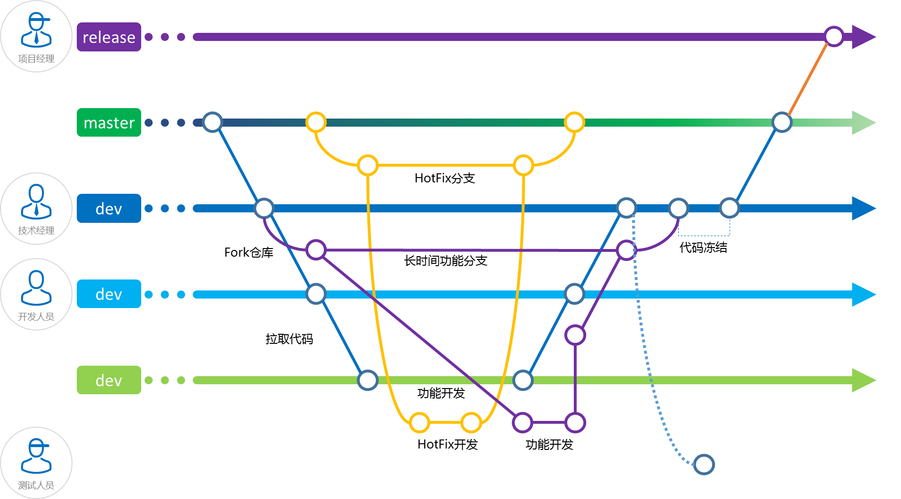
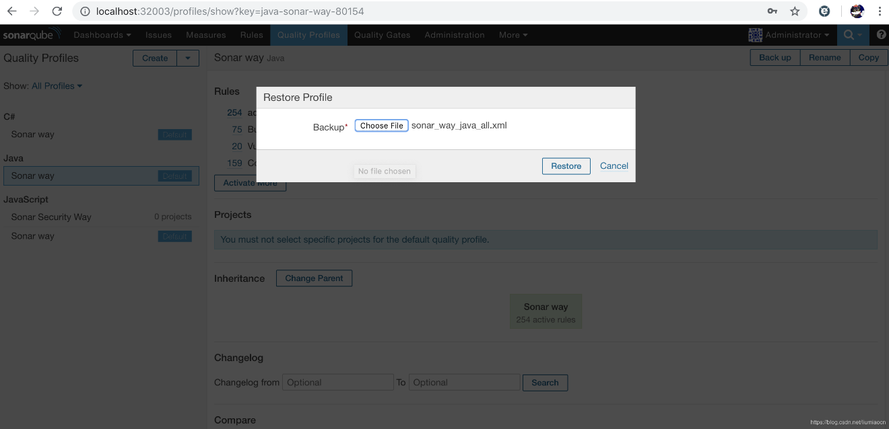
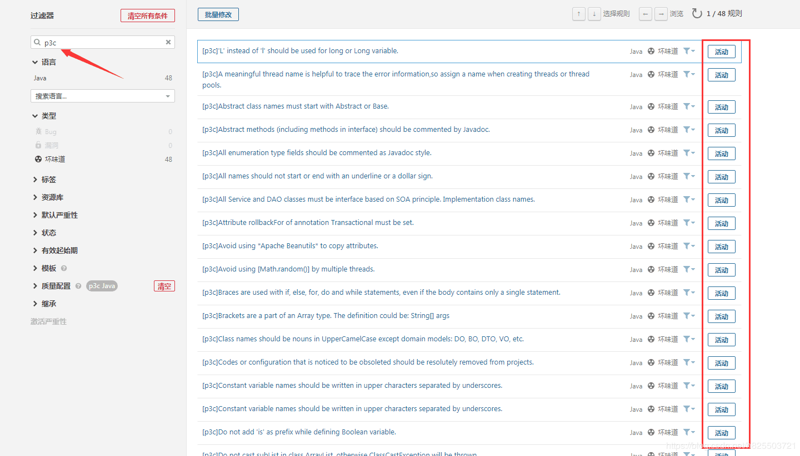
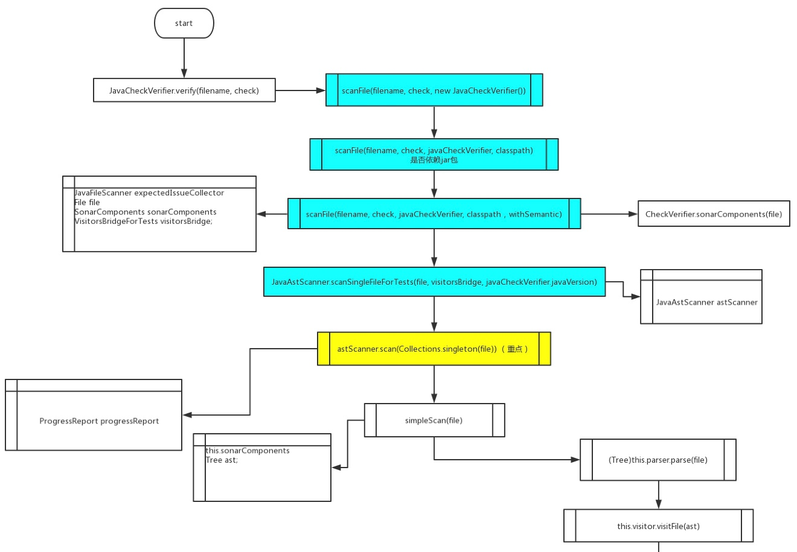
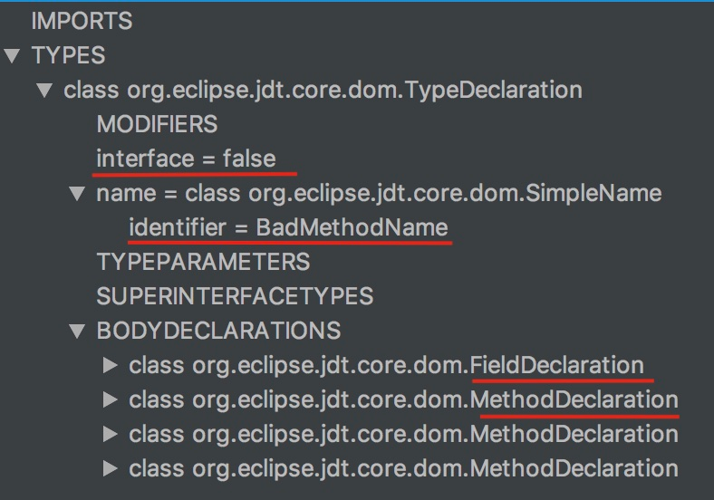
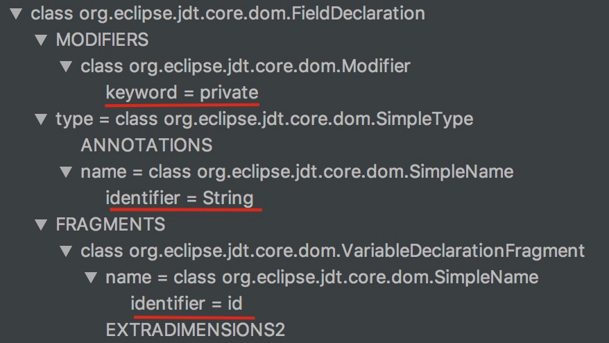
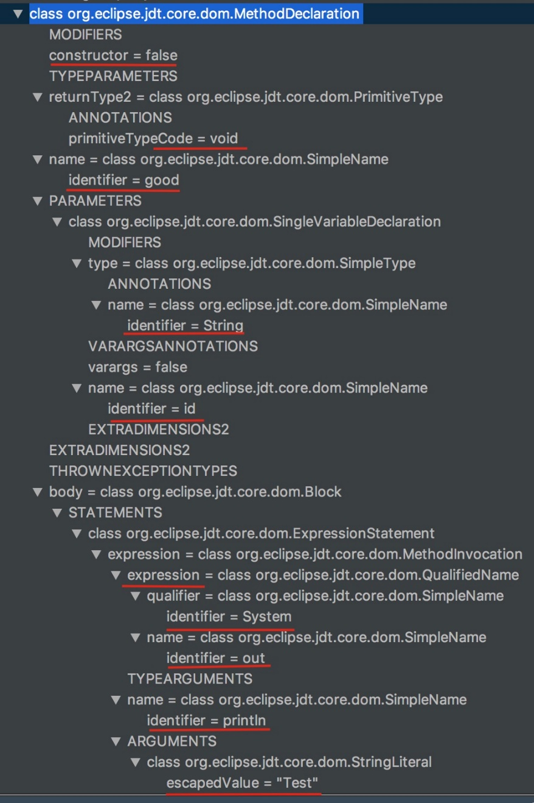
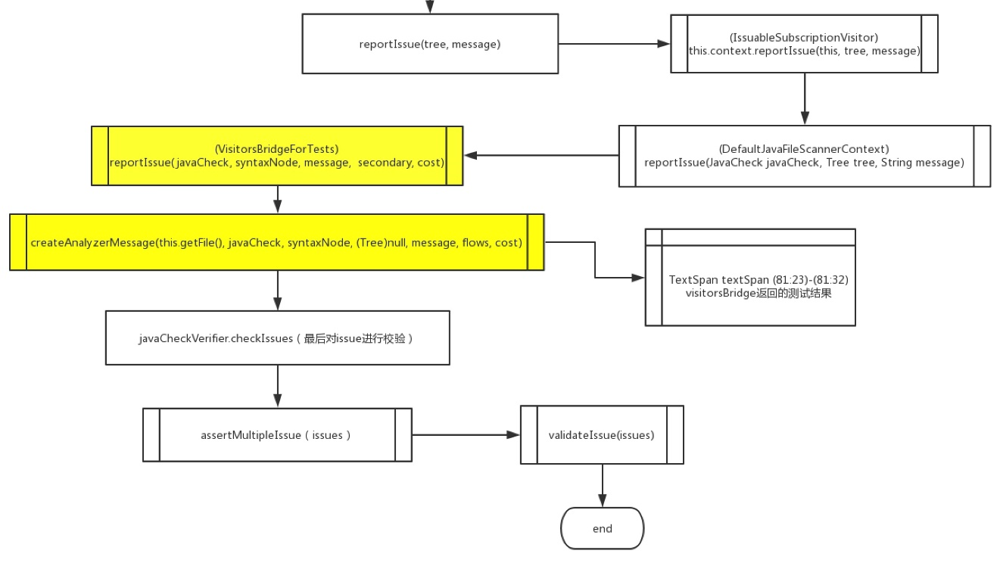

# CD-TM-CQ-QR-L2-01-代码质量规约文档

<table border="0" bordercolor="#FFFFFF">
  <tr>
    <th></th>
    <th><h1 style="font-size:150%">能力项  [代码质量管理]</h1></th>
  </tr>
</table>

# 前言

随着 IT 行业中软件产品的推陈出新，客户对于软件产品的要求也越来越高，因此如何高质量的管理软件代码，及时地对代码质量进行分析并给出合理的解决方案就成为了当下必须要解决的一个问题。本文讨论的代码质量指的是代码本身的质量，包括复杂度、重复率、代码风格等要素。

代码是团队的共同财产，代码质量是团队技术水平和管理水平的直接体现。

# 目的                    

对于软件项目来说，代码质量代表着系统的有序程度，低质量代码增加就是系统无序性上升的体现。在无外力影响的情况下，低质量代码只会原来越多。为了维持系统有序，需要外界向系统不断输入能量。对于代码质量，需要主动投入资源，来有意识地抑制低质量代码越来越多的自然趋势。项目组通过自动化工具和流程来提升团队代码质量。

# 自动化代码质量检查

自动化代码质量检查是指在代码规范的基础上，使用自动化工具进行质量检查，通常包括：

- 代码规范检查 - 包括风格规范、实践规范、业务规范
  - 风格规范 - 缩进、换行、大小写等风格问题
  -   实践规范 - 规避一些常见的隐患，或者针对特定问题的最佳实践
  - 业务规范 - 与业务有关的特殊要求，比如编码文本中的关键词

- 重复率 - 重复出现的代码区块占比，通常要求在5%以下

- 复杂度 - 总行数，模块大小，循环复杂度等

- 检查覆盖度 - 经过检查的行数占代码库总行数的比例

自动化质量检查可以覆盖多数常见问题，能够提升开发效率，也可以降低人工Code Review的成本。自动化检查工具的规则集与代码规范直接对应。支持通过编辑器插件，在写代码的时候直接给出检查结果。团队的代码规范文档不需要陈述各种细节，开发者可以直接通过查看自动化工具的规则集来了解代码规范。项目的自动化质量工具检测规范放置在项目组代码[Git Address]/[group name]/[project name]/tree/dev/test/sonarpolicy/中

# Sonarqube Quality Gate

存在以下问题，Sonarqube 质量检查会失败：

## Blocker Issues is greater than 0

`Blocker` 问题大概率产生影响应用正常使用的bug，如内存泄漏，未关闭的jdbc连接等等。 **必须修复**

## Critical Issues is greater than 0

`Critical` 问题小概率产生影响应用正常使用的bug，或安全问题。**必须修复**

## Coverage on New Code is less than 20.0%

新代码的覆盖率必须要大于20%。

## Maintainability Rating on New Code is worse than A

可维护性评分必须为A  

每个代码Code Smells都有一个默认的修复时间，根据这个时间 `计算技术债务=修复成本/开发成本`

技术债务占比：

- 小于等于5％，评级为A.
- 6至10％之间的评级是B
- 在11％至20％之间的评级是C
- 在21到50％之间，评级是D
- 任何超过50％是E

## Reliability Rating on New Code is worse than A

可靠性评分必须为A

- A = 0错误
- B =至少1次轻微错误
- C =至少1次重大错误
- D =至少1次严重错误
- E =至少1次阻止程序错误

## Security Rating on New Code is worse than A

安全性评分必须为A

- A = 0漏洞
- B =至少1次轻微漏洞
- C =至少1次重大漏洞
- D =至少1次严重漏洞
- E =至少1次阻止漏洞


# 代码质量控制流程

代码质量控制流程将自动化代码质量检查和Code Review与代码流动的过程绑定，从而保证所有上线的代码都经过机器与人工多个环节的检查。



执行自动化代码质量检查的时机：

- 编辑时 - 使用编辑器插件，实时运行质量检查

- 构建时 - 在本地或者开发机的构建脚本中运行质量检查

- 提交时 - 利用Git Hooks，提交代码或者生成Merge Request时运行质量检查

- 发布时 - 在发布脚本中再做一次质量检查，通常与自动化测试放在一起

除了人工的Code Review之外，各个环节的代码质量检查都是机器自动运行的，不会给开发者带来额外的成本。

# 代码质量监控

当团队规模越来越大，项目越来越多时，代码质量管控就会面临以下问题：

- 不同项目使用的代码规范不一样

- 部分项目由于放松要求，没有接入质量检查，或者存在大量未修复的缺陷

- 无法从团队整体层面上体现各个项目的质量状况对比

为了应对以上问题，从管理层面建设了跨项目的的代码质量管监体系，要点包括：

- 代码规范统一管理。使用Gitlab代码化管理自动化代码质量检查的规则集，统一数据源，不在本地写规则。一个团队、一类项目、一套规则。

- 使用统一的持续集成服务。质量检查不通过的项目不能上线。

- 建立项目集的统一质量数字化评价机制。让项目与项目之间能够横向对比，项目自身能够纵向对比，并且进行汇总反馈。

# 代码质量管理工具

与当今众多的代码质量管理工具相比，SonarQube 更具有特色和竞争力，其优势主要体现为：它是一个开源的代码质量管理系统，支持 25+ 种语言，可以通过使用插件机制与 Gitlab和 Gitlab-CI 等其他外部工具集成，从而实现了对代码的质量的全面自动化分析和管理。

SonarQube 并不是简单地将各种质量检测工具的结果（例如 FindBugs，PMD 等）直接展现给客户，而是通过不同的插件算法来对这些结果进行再加工，最终以量化的方式来衡量代码质量，从而方便地对不同规模和种类的工程进行相应的代码质量管理。

SonarQube 在进行代码质量管理时，会至少从以下纬度来分析项目的质量：

- 复杂度分布(complexity):代码复杂度过高将难以理解

- 重复代码(duplications):程序中包含大量复制、粘贴的代码而导致代码臃肿，sonar可以展示源码中重复严重的地方 

- 单元测试统计(unit tests):统计并展示单元测试覆盖率，开发或测试可以清楚测试代码的覆盖情况

- 代码规则检查(coding rules):通过Findbugs,PMD,CheckStyle等检查代码是否符合规范

- 注释率(comments):若代码注释过少，特别是人员变动后，其他人接手比较难接手；若过多，又不利于阅读

- 潜在的Bug(potential bugs):通过Findbugs,PMD,CheckStyle等检测潜在的bug 

- 结构与设计(architecture & design):找出循环，展示包与包、类与类之间的依赖、检查程序之间耦合度

SonarQube 可以支持 25+ 种编程语言，针对不同的编程语言其所提供的分析方式也有所不同：

- 对于所有支持的编程语言，SonarQube 都提供源了代码的静态分析功能；

- 对于某些特定的编程语言，SonarQube 提供了对编译后代码的静态分析功能，比如 java 中的 class file 和 jar 和 C# 中的 dll file 等；

- 对于某些特定的编程语言，SonarQube 还可以提供对于代码的动态分析功能，比如 java 和 C# 中的单元测试的执行等。

远程客户机可以通过各种不同的分析机制，将被分析的项目代码通过流水线驱动，使用 SonarQube server 并进行代码质量的管理和分析，SonarQube还会通过 Web API 将分析的结果以可视化、可度量的方式展示给用户。

SonarQube登陆成功后点击 configuration 菜单按钮，然后选择 update center 进行插件的下载与安装。下载 Sonarqube 插件的官方地址为：<http://docs.codehaus.org/display/SONAR/Plugin+Library/> ，下载时需注意插件板本与 sonarqube的兼容问题。

当项目代码被成功分析完成后，SonarQube Server 会将分析的结果存储在相应的数据库中，并以报告的形式将分析结果在 webserver 中展示给用户。项目开发者会在代码提交后，从MR讨论区中获得Sonar服务反馈的分析结果链接。

# sonarqube扫描规则

SonarQube内嵌了Sonar way的扫描规则，不同语言具有不同版本，比如C#/Java/Javascript等，缺省从三个维度对规则进行划分：

- 可靠性（Reliability）：标记为Bug类别的规则。一些潜在的Bug，如Findbugs扫出来的一些bug。

- 安全（Security）：标记为Vulnerability类别的规则，来源于CWE、OWASP Top 10的一些规则。

- 可维护性（Maintainability）：标记为Code Smells 类别的规则，均属于可维护性范畴，比如代码可读性、代码规范等

| 总类                  | 规则数量 |
| --------------------- | -------- |
| 缺陷（Bug）           | 75       |
| 安全（Vulnerability） | 20       |
| 改善（Code Smell）    | 159      |

Sonar缺省从Bug/Vulnerability/Code Smell维度进行划分，同时不同维度的扫描规则的等级也有所不同，比如Major或者Minor，在实际使用的时候可以根据具体情况进行调整.

| 缺陷相关的规则                                               |
| ------------------------------------------------------------ |
| “.equals()” should not be   used to test the values of “Atomic” classes |
| “@NonNull” values should   not be set to null                |
| “BigDecimal(double)” should   not be used                    |
| “Calendars” and   “DateFormats” should not be static         |
| “Cloneables” should   implement “clone”                      |
| “compareTo” should not   return “Integer.MIN_VALUE”          |
| “Double.longBitsToDouble”   should not be used for “int”     |
| “equals(Object obj)” and   “hashCode()” should be overridden in pairs |
| “equals(Object obj)” should   be overridden along with the “compareTo(T obj)” method |
| “equals(Object obj)” should   test argument type             |
| “Externalizable” classes   should have a no-arguments constructor |
| “hashCode” and “toString”   should not be called on array instances |
| “instanceof” operators that   always return “true” or “false” should be removed |
| “InterruptedException”   should not be ignored               |
| “Iterator.hasNext()” should   not call “Iterator.next()”     |
| “Object.wait(…)” and   “Condition.await(…)” should be called inside a “while” loop |
| “Object.wait(…)” should   never be called on objects that implement   “java.util.concurrent.locks.Condition” |
| “PreparedStatement” and   “ResultSet” methods should be called with valid indices |
| “read” and “readLine”   return values should be used         |
| “return” statements should   not occur in “finally” blocks   |
| “runFinalizersOnExit”   should not be called                 |
| “ScheduledThreadPoolExecutor”   should not have 0 core threads |
| “Serializable” inner   classes of non-serializable classes should be “static” |
| “SingleConnectionFactory”   instances should be set to “reconnectOnException” |
| “toString()” and “clone()”   methods should not return null  |
| “wait(…)”, “notify()” and   “notifyAll()” methods should only be called when a lock is obviously held on   an object |
| A “for” loop update clause   should move the counter in the right direction |
| Assertions should be   complete                              |
| Assignments should not be   made from within sub-expressions |
| Classes should not be   compared by name                     |
| Collections should not be   passed as arguments to their own methods |
| Conditions should not   unconditionally evaluate to “TRUE” or to “FALSE” |
| Custom serialization method   signatures should meet requirements |
| Default EJB interceptors   should be declared in “ejb-jar.xml” |
| Dissimilar primitive   wrappers should not be used with the ternary operator without explicit   casting |
| Fields in a “Serializable”   class should either be transient or serializable |
| Floating point numbers   should not be tested for equality   |
| Identical expressions   should not be used on both sides of a binary operator |
| IllegalMonitorStateException   should not be caught          |
| Inappropriate “Collection”   calls should not be made        |
| Inappropriate regular   expressions should not be used       |
| Instance methods should not   write to “static” fields       |
| Ints and longs should not   be shifted by more than their number of bits-1 |
| Invalid “Date” values   should not be used                   |
| JUnit assertions should not   be used in “run” methods       |
| JUnit framework methods   should be declared properly        |
| JUnit test cases should   call super methods                 |
| Locks should be released                                     |
| Loop conditions should be   true at least once               |
| Loops should not be   infinite                               |
| Math operands should be   cast before assignment             |
| Methods “wait(…)”,   “notify()” and “notifyAll()” should never be called on Thread instances |
| Methods should not be named   “hashcode” or “equal”          |
| Multiline blocks should be   enclosed in curly braces        |
| Neither “Math.abs” nor   negation should be used on numbers that could be “MIN_VALUE” |
| Non-public methods should   not be “@Transactional”          |
| Non-serializable classes   should not be written             |
| Non-serializable objects   should not be stored in “HttpSessions” |
| Null pointers should not be   dereferenced                   |
| Objects should not be   created to be dropped immediately without being used |
| Printf-style format strings   should not lead to unexpected behavior at runtime |
| Raw byte values should not   be used in bitwise operations in combination with shifts |
| Reflection should not be   used to check non-runtime annotations |
| Related “if/else if”   statements should not have the same condition |
| Relational operators should   be used in “for” loop termination conditions |
| Resources should be closed                                   |
| Servlets should not have   mutable instance fields           |
| Short-circuit logic should   be used in boolean contexts     |
| Silly equality checks   should not be made                   |
| super.finalize() should be   called at the end of Object.finalize() implementations |
| Synchronization should not   be based on Strings or boxed primitives |
| The non-serializable super   class of a “Serializable” class should have a no-argument constructor |
| The value returned from a   stream read should be checked    |
| Thread.run() and   Runnable.run() should not be called directly |
| Values should not be   uselessly incremented                 |

| 脆弱性相关的规则                                             |
| ------------------------------------------------------------ |
| “ConcurrentLinkedQueue.size()”   should not be used          |
| “enum”   fields should not be publicly mutable               |
| “File.createTempFile”   should not be used to create a directory |
| “HttpServletRequest.getRequestedSessionId()”   should not be used |
| “public   static” fields should be constant                  |
| “static   final” arrays should be “private”                  |
| “wait(…)”   should be used instead of “Thread.sleep(…)” when a lock is held |
| Cookies   should be “secure”                                 |
| Credentials   should not be hard-coded                       |
| Cryptographic   RSA algorithms should always incorporate OAEP (Optimal Asymmetric Encryption   Padding) |
| Exceptions   should not be thrown from servlet methods       |
| Generic   exceptions should never be thrown                  |
| IP   addresses should not be hardcoded                       |
| Mutable   fields should not be “public static”               |
| The   Object.finalize() method should not be called          |
| Throwable   and Error should not be caught                   |
| Throwable.printStackTrace(…)   should not be called          |
| Values   passed to SQL commands should be sanitized          |
| Web   applications should not have a “main” method           |
| Web   applications should use validation filters             |

| 改善相关的规则                                               |
| ------------------------------------------------------------ |
| “@Override”   annotation should be used on any method overriding (since Java 5) or   implementing (since Java 6) another one |
| “assert”   should only be used with boolean variables        |
| “catch”   clauses should do more than rethrow                |
| “clone”   should not be overridden                           |
| “compareTo”   results should not be checked for specific values |
| “DateUtils.truncate”   from Apache Commons Lang library should not be used |
| “entrySet()”   should be iterated when both the key and value are needed |
| “finalize”   should not set fields to “null”                 |
| “FIXME”   tags should be handled                             |
| “for”   loop incrementers should modify the variable being tested in the loop’s stop   condition |
| “for”   loop stop conditions should be invariant             |
| “indexOf”   checks should not be for positive numbers        |
| “indexOf”   checks should use a start position               |
| “Iterator.next()”   methods should throw “NoSuchElementException” |
| “Lock”   objects should not be “synchronized”                |
| “Object.finalize()”   should remain protected (versus public) when overriding |
| “private”   methods called only by inner classes should be moved to those classes |
| “readObject”   should not be “synchronized”                  |
| “readResolve”   methods should be inheritable                |
| “ResultSet.isLast()”   should not be used                    |
| “static”   members should be accessed statically             |
| “StringBuilder”   and “StringBuffer” should not be instantiated with a character |
| “switch   case” clauses should not have too many lines       |
| “switch”   statements should end with a “default” clause     |
| “switch”   statements should have at least 3 “case” clauses  |
| “switch”   statements should not contain non-case labels     |
| “switch”   statements should not have too many “case” clauses |
| “Thread.sleep”   should not be used in tests                 |
| “Threads”   should not be used where “Runnables” are expected |
| “TODO”   tags should be handled                              |
| “toString()”   should never be called on a String object     |
| “URL.hashCode”   and “URL.equals” should be avoided          |
| @FunctionalInterface   annotation should be used to flag Single Abstract Method interfaces |
| A   “while” loop should be used instead of a “for” loop      |
| A   field should not duplicate the name of its containing class |
| Abstract   classes without fields should be converted to interfaces |
| Abstract   methods should not be redundant                   |
| Annotation   repetitions should not be wrapped               |
| Anonymous   inner classes containing only one method should become lambdas |
| Array   designators “[]” should be located after the type in method signatures |
| Array   designators “[]” should be on the type, not the variable |
| Boxing   and unboxing should not be immediately reversed     |
| Branches   should have sufficient coverage by unit tests     |
| Case   insensitive string comparisons should be made without intermediate upper or   lower casing |
| Catches   should be combined                                 |
| Child   class members should not shadow parent class members |
| Child   class methods named for parent class methods should be overrides |
| Class   names should comply with a naming convention         |
| Class   names should not shadow interfaces or superclasses   |
| Class   variable fields should not have public accessibility |
| Classes   extending java.lang.Thread should override the “run” method |
| Classes   from “sun.*” packages should not be used           |
| Classes   named like “Exception” should extend “Exception” or a subclass |
| Classes   should not be empty                                |
| Classes   that override “clone” should be “Cloneable” and call “super.clone()” |
| Classes   with only “static” methods should not be instantiated |
| Collapsible   “if” statements should be merged               |
| Collection.isEmpty()   should be used to test for emptiness  |
| Collections.emptyList(),   emptyMap() and emptySet() should be used instead of Collections.EMPTY_LIST,   EMPTY_MAP and EMPTY_SET |
| Constant   names should comply with a naming convention      |
| Constants   should not be defined in interfaces              |
| Constructor   injection should be used instead of field injection |
| Control   flow statements “if”, “for”, “while”, “switch” and “try” should not be nested   too deeply |
| Dead   stores should be removed                              |
| Declarations   should use Java collection interfaces such as “List” rather than specific   implementation classes such as “LinkedList” |
| Dependencies   should not have “system” scope                |
| Deprecated   “${pom}” properties should not be used          |
| Deprecated   code should be removed eventually               |
| Deprecated   elements should have both the annotation and the Javadoc tag |
| Empty   arrays and collections should be returned instead of null |
| Enumeration   should not be implemented                      |
| Exception   classes should be immutable                      |
| Exception   handlers should preserve the original exception  |
| Exception   types should not be tested using “instanceof” in catch blocks |
| Exceptions   should not be thrown in finally blocks          |
| Execution   of the Garbage Collector should be triggered only by the JVM |
| Exit   methods should not be called                          |
| Expressions   should not be too complex                      |
| Field   names should comply with a naming convention         |
| Fields   in non-serializable classes should not be “transient” |
| Future   keywords should not be used as names                |
| Generic   wildcard types should not be used in return parameters |
| Inheritance   tree of classes should not be too deep         |
| Inner   class calls to super class methods should be unambiguous |
| Interface   names should comply with a naming convention     |
| JUnit   rules should be used                                 |
| Labels   should not be used                                  |
| Lambdas   and anonymous classes should not have too many lines |
| Lambdas   should be replaced with method references          |
| Lamdbas   containing only one statement should not nest this statement in a block |
| Literal   boolean values should not be used in condition expressions |
| Local   variable and method parameter names should comply with a naming convention |
| Local   Variables should not be declared and then immediately returned or thrown |
| Local   variables should not shadow class fields             |
| Long   suffix “L” should be upper case                       |
| Loops   should not contain more than a single “break” or “continue” statement |
| Maps   with keys that are enum values should be replaced with EnumMap |
| Method   names should comply with a naming convention        |
| Method   overrides should not change contracts               |
| Method   parameters, caught exceptions and foreach variables should not be reassigned |
| Methods   and field names should not be the same or differ only by capitalization |
| Methods   named “equals” should override Object.equals(Object) |
| Methods   of “Random” that return floating point values should not be used in random   integer generation |
| Methods   should not be empty                                |
| Methods   should not be too complex                          |
| Methods   should not have too many parameters                |
| Modifiers   should be declared in the correct order          |
| Multiple   variables should not be declared on the same line |
| Nested   "enum"s should not be declared static               |
| Nested   blocks of code should not be left empty             |
| Nested   code blocks should not be used                      |
| Non-constructor   methods should not have the same name as the enclosing class |
| Null   should not be returned from a “Boolean” method        |
| Objects   should not be created only to “getClass”           |
| Only   static class initializers should be used              |
| Overriding   methods should do more than simply call the same method in the super class |
| Package   declaration should match source file directory     |
| Package   names should comply with a naming convention       |
| Parentheses   should be removed from a single lambda input parameter when its type is   inferred |
| Parsing   should be used to convert “Strings” to primitives  |
| Primitive   wrappers should not be instantiated only for “toString” or “compareTo” calls |
| Primitives   should not be boxed just for “String” conversion |
| Public   constants and fields initialized at declaration should be “static final”   rather than merely “final” |
| Public   methods should throw at most one checked exception  |
| Redundant   casts should not be used                         |
| Return   of boolean expressions should not be wrapped into an “if-then-else” statement |
| Sections   of code should not be “commented out”             |
| Silly   bit operations should not be performed               |
| Silly   math should not be performed                         |
| Source   files should not have any duplicated blocks         |
| Standard   outputs should not be used directly to log anything |
| Statements   should be on separate lines                     |
| Static   non-final field names should comply with a naming convention |
| String   function use should be optimized for single characters |
| String   literals should not be duplicated                   |
| String.valueOf()   should not be appended to a String        |
| Strings   literals should be placed on the left side when checking for equality |
| Subclasses   that add fields should override “equals”        |
| Switch   cases should end with an unconditional “break” statement |
| Synchronized   classes Vector, Hashtable, Stack and StringBuffer should not be used |
| TestCases   should contain tests                             |
| The   default unnamed package should not be used             |
| The   diamond operator ("<>") should be used                 |
| The   members of an interface declaration or class should appear in a pre-defined   order |
| The   Object.finalize() method should not be overriden       |
| The   signature of “finalize()” should match that of “Object.finalize()” |
| Throws   declarations should not be superfluous              |
| Try-catch   blocks should not be nested                      |
| Try-with-resources   should be used                          |
| Type   parameter names should comply with a naming convention |
| Unused   labels should be removed                            |
| Unused   local variables should be removed                   |
| Unused   method parameters should be removed                 |
| Unused   private fields should be removed                    |
| Unused   private method should be removed                    |
| Unused   type parameters should be removed                   |
| Useless   imports should be removed                          |
| Useless   parentheses around expressions should be removed to prevent any   misunderstanding |
| Utility   classes should not have public constructors        |

# 扫描规则管理

## 规则导出：

从SonarQube中使用back up按钮导出来的规则列表的Quality Profile文件。

## 代码化规则存储：

项目的扫描规则以代码化的形式放置在[Gitlab Address]/bjyd/[project name]/tree/dev/test/sonarpolicy/目录中。以代码的形式进行管理，演进和使用。

一旦规则定制好了，还需要持续跟进，不断去掉不适用的规则，新增有用的规则。另外团队定制规则的基础就是要确保规则集是研发团队共同定制出来的，而不是上面指定的，这样大家才有积极性来维护自己的代码规则。

## 规则导入：

手工加载代码规则的方法：

`Quality Profiles` -> `Create`->` Restore Profiles`，单击`Restore`，即可生成Sonar的新的Profile。



API导入规则的方法

通过Restful API导入规则的方法可以将代码化的规则通过流水线导入代码扫描工具，保证代码扫描规则和代码的版本一致性。

通过curl调用API:

```shell
curl -X POST -uadmin:admin http://localhost:32003/api/qualityprofiles/restore --form backup=@sonar-java-test-profile.xml
```

执行命令说明：

- -u指定用户名和密码

- POST方式使用/api/qualityprofiles/restore

- backup为必须指定内容

- 生成的profile名称为xml中设定的内容

- 如果当前profile已经存在则会覆盖生成

## 禁用规则

点击质量配置，通过active和inactive选项，可分别对已启用规则进行禁用挂起，已禁用规则启用。需要注意：sonarqube内置的规则是没办法启用禁用的。



## 删除规则

可以用POST的方式调用/api/qualityprofiles/delete 进行删除，但是注意由于在sonar中使用profileKey来唯一确定，为了避免误删其他语言中同名的profile，在使用profileName进行删除的时候需要结合使用language。

```shell
curl -X POST http://localhost:32003/api/qualityprofiles/delete -d "profileName=sonar-java-test-profile&language=java" -uadmin:admin
```

执行命令说明：

- -u指定用户名和密码

- POST方式使用/api/qualityprofiles/delete

- 使用profileKey或profileName删除，profileName进行删除的时候需要结合使用language。

# 新建扫描规则

通过sonar的自定义规则开发，扩展和定制sonar的扫描规则，更适合项目组的特点和文化。

以[sonar规则官网](https://github.com/SonarSource/sonar-java) 的**BadMethodNameCheck**规则为例。

## sonar前置

Test JavaCheckVerifier.verify 

```java
@Test
public void test() {
    JavaCheckVerifier.verify("src/test/files/checks/naming/BadMethodName.java", new BadMethodNameCheck());
}
```

在上面的代码中，测试用例里面调用了类JavaCheckVerifier的verify方法，传入一个文件路径（需要被扫描的测试代码）以及一个
BadMethodNameCheck对象（自定义的规则）：



传入了文件以及规则后，sonar内部进行了一系列的scanFile操作，大多数是进行一些前置准备。比较重要的是visitorsBridge、astScanner、ast等对象。

- visitorsBridge对象 

用于保存通过规则对被测代码扫描后的结果

- astScanner对象

提供扫描被测代码的解析功能并生成抽象语法树--Tree ast对象。

简单的来说，在这一阶段就是进行初始化，生成保存结果集的变量，并且将被测代码解析为抽象语法树。

可以通过Idea下载插件 JDT AST工具生成抽象语法树帮助理解。但实际sonar生成的语法树在格式上与JDT生成的会不太一致，使用时候需要注意下。

以以下扫描代码内容为例（为了内容简短，删除了部分代码）:

```java
class BadMethodName {
    private String id;
    public BadMethodName() {}

    void Bad() { // Noncompliant [[sc=8;ec=11]] {{Rename this method name to match the regular expression '^[a-z][a-zA-Z0-9]*$'.}}
    }

    void good(String id) {
        System.out.println("Test");
    }
}

```

通过AST工具生成的抽象语法树

全局的语法树如下：可以获取代码中的该类是否是接口、类名以及类中定义的类变量以及方法。



针对类变量的语法树如下：可以获取到变量名称、类型、修饰类型。



针对方法生成的语法树如下：可以获取到方法名、返回值、修饰符、是否是构造函数和代码块，所有在
**{ code }** 内的又会被解析成一个**blockTree**。



通过sonar的前置操作解析，可以得到一套标准化的语法树。

## 用户代码

自定义规则开发的思路就是通过过滤顶层Tree拿到想要的节点Tree（如MethodTree、ClassTree、BlockTree、ExpressionStatementTree等），然后根据用户开发逻辑代码实现校验功能。现在来说明下sonar在用户代码里面常用的一些内部方法。

- **nodesToVisit**()

```java
public List<Tree.Kind> nodesToVisit() {
    return ImmutableList.of(Tree.Kind.METHOD);
}
```

指定要扫描的节点(也就是树的分支)，并在visitNode方法中获取到指定的节点，像上面代码就是返回Tree中的所有MethodTree。

- **visitNode**()

```java
public void visitNode(Tree tree) {
    MethodTree methodTree = (MethodTree) tree;
    if (isNotOverriden(methodTree) && pattern.matcher(methodTree.simpleName().name()).matches()) {
        reportIssue(methodTree.simpleName(), "Rename this method name to match the regular expression '" + format + "'.");
    }
}

```

获取到nodesToVisit中的过滤后的所有节点Tree，并且按照用户指定的逻辑进行校验。

- **setContext**()

```java
public void setContext(JavaFileScannerContext context) {
    if (pattern == null) {
        pattern = Pattern.compile(format, Pattern.DOTALL);
    }
    super.setContext(context);
}

```

super.setContext(context) 获取第一步中初始化的 visitorsBridge 对象，用于存储测试结果。

本阶段需要保证自定义的校验代码不出现漏查或者误查，避免出现扫描检测出来的结果有误。

## 单测结果校验

```java
reportIssue(methodTree.simpleName(), "Rename this method name to match the regular expression '" + format + "'.");

public void reportIssue(Tree tree, String message) {
    context.reportIssue(this, tree, message);
}
```

一般在用户规则中，当触犯规则后需要进行错误校验，流程图如下。



从流程图可以很清楚的发现，开始也是一系列 **reportIssues** 结果收集，一直到
**VistorsBridgeForTests** 中才开始进行触发规则的内容解析操作，获取了触犯规则的代码行数以及字符串具体的位置，记录在**textSpan**变量中，结果保存在**issues**列表中。

```java
void Bad2() { // Noncompliant
```

通过最初扫描代码记录了标记Noncompliant的行数以及字符串位置为预期值，最后根据CheckVerifer.validateIssue方法进行预期与实际issues存储的结果进行比较。至此单测自定义规则的整个流程就结束了。

结果校验中易出错误说明：

- At least one issue expected

通过规则进行文件扫描后，未发现任何一个触发了reportIssue方法，最后的issues的长度为0导致报错。

- Expected {3=[{}]}, Unexpected at [11]

预期的标记 Noncompliant 位置的代码行数与实际扫描出来的结果不一致

需要注意自定义校验代码需要保证校验的结果正确性以及减少误报率。