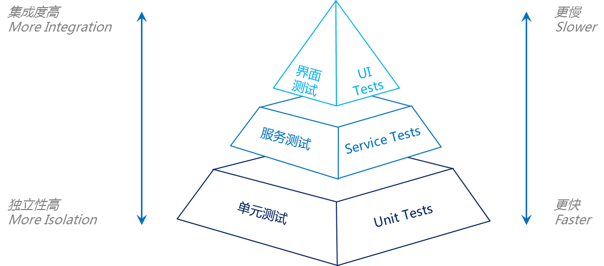
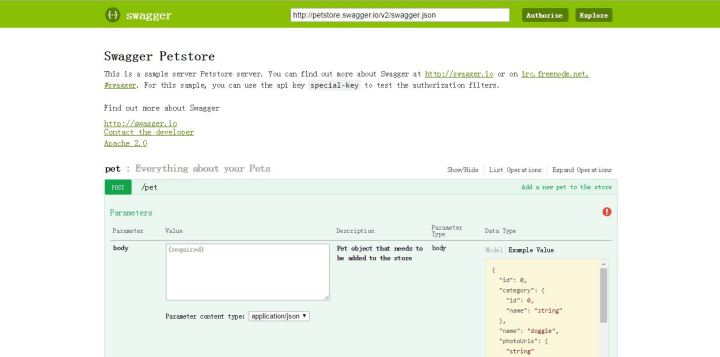
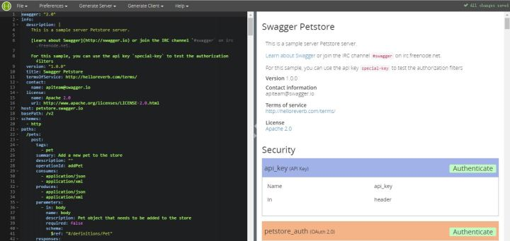

# CD-TM-AT-AD-L3-01-接口服务级自动化测试设计文档

<table border="0" bordercolor="#FFFFFF">
  <tr>
    <th></th>
    <th><h1 style="font-size:150%">能力项  [自动化测试]</h1></th>
  </tr>
</table>

# 前言

软件测试的定义是：在规定的条件下对程序进行操作，以发现程序错误，衡量软件质量，并对其是否能满足设计要求进行评估的过程。自动化测试是使用软件工具和既定程序，对软件所进行的测试活动。

面临需求时间跨度长的困难，如果有自动化测试约束，则其演变一定是一个受控的过程。这恰恰说明了实施自动化测试有非常重要的意义。相对于热补技术这种事后补救技术，自动化测试才是更根本性的质量保障手段。

根据测试金字塔分层模型最底层是单元测试，然后是API接口测试，最后是业务流程自动化测试。界面级的业务流程测试在敏捷开发和 DevOps 的快速迭代和频繁变更中很难维护，所以API 测试在自动化测试中有着很重要的地位，因为 API 一般是应用逻辑的主要接口。

# 目的

API 测试是一种作为集成测试的一部分，通过直接控制被测应用的接口（API）来确定是否在功能、可靠性、性能和安全方面达到预期的软件测试活动。由于 API 都没有 GUI 界面，API 测试都是在通讯层进行的。

本文描述API 接口测试的要求、特点以及设计方法和工具。

# 金字塔分层模型

在敏捷方法中，持续集成是其基石，持续集成的核心是自动化测试。测试金字塔的概念来自Mike Cohn，在他的书《Succeeding with Agile》中有详细描述：测试金字塔最底层是单元测试，然后是业务逻辑测试，最后是端到端的测试（GUI或CLI）。



这个比喻非常形象，它让你一眼就知道测试是需要分层的。它还告诉你每一层需要写多少测试。

根据 Mike Cohn 的测试金字塔，建议测试组合应该由以下三层组成（自下往上分别是）：

- 单元测试

- 服务测试

- 用户界面测试

从具体项目的角度来看，测试金字塔似乎过于简单了，因此可能会产生误导。然而，由于其简洁性，在建立适合项目的测试组合时，测试金字塔本身是一条很好的经验法则。Cohn 测试金字塔中提到的两个原则是非常重要的：

- 编写不同粒度的测试
- 层次越高，编写的测试应该越少

为了维持金字塔形状，一个健康、快速、可维护的测试组合应该是这样的：写许多小而快的单元测试。适当写一些更粗粒度的测试，写很少高层次的端到端测试。注意不要让测试组合变成倒三角形，那对维护来说将是一个噩梦，并且跑一遍也需要太多时间。

不要太拘泥于 Cohn 测试金字塔中各层次的名字。事实上，它们可能相当具有误导性：服务测试是一个难以掌握的术语（Cohn 本人说他观察到很多开发人员完全忽略了这一层）。如果项目使用单页应用框架（如 react，angular，ember.js 等），UI 测试显然不必位于金字塔的最高层，完全能够用这些框架对 UI 进行单元测试。

考虑到原始名称的缺点，只要在代码库和团队中通过讨论中达成一致，完全可以为测试层次提供其他名称。

本项目采取单元测试、服务测试、用户界面测试的分层模型，其中使用API接口测试进行服务自动化测试。

# 测试工具

## Swagger

Swagger是一种Rest API的 简单但强大的表示方式，标准的，语言无关，这种 表示方式不但人可读，而且机器可读。 可以作为Rest API的交互式文档，也可以作为Rest API的形式化的接口描述，生成客户端和服务端的代码。

**Swagger API Spec/Open API Spec**           

Swagger API Spec是Swagger用来描述Rest API的语言，类似于描述Web服务的WSDL。Swagger API可以使用yaml或json来表示。 2016年1月，Swagger将Spec捐献给Open API Initiative (OAI)，成为Open API Spec的基础。

Swagger API Spec包含以下部分：

- swagger，指定swagger spec版本，2.0

- info，提供API的元数据

- tags，补充的元数据，在swagger ui中，用于作为api的分组标签

- host，主机，如果没有提供，则使用文档所在的host

- basePath，相对于host的路径

- schemes，API的传输协议，http，https，ws，wss

- consumes，API可以消费的MIME类型列表

- produces，API产生的MIME类型列表

- paths，API的路径，以及每个路径的HTTP方法，一个路径加上一个HTTP方法构成了一个操作。每个操作都有以下内容：

- tags，操作的标签

- summary，短摘要

- description，描述

- externalDocs，外部文档

- operationId，标识操作的唯一字符串

- consumes，MIME类型列表

- produces，MIME类型列表

- parameters，参数列表

- responses，应答状态码和对于的消息的Schema

- schemes，传输协议

- deprecated，不推荐使用

- security，安全

- definitions，定义API消费或生产的数据类型，使用json-schema描述，操作的parameter和response部分可以通过引用的方式使用definitions部分定义的schema

- parameters，多个操作共用的参数

- responses，多个操作共用的响应

- securityDefinitions，安全scheme定义

- security，安全声明

- externalDocs，附加的外部文档

下面是一个操作的描述：

```yaml
/pets/findByTags:
    get:
      tags:
        - pet
      summary: Finds Pets by tags
      description: Muliple tags can be provided with comma seperated strings. Use tag1, tag2, tag3 for testing.
      operationId: findPetsByTags
      produces:
        - application/json
        - application/xml
      parameters:
        - in: query
          name: tags
          description: Tags to filter by
          required: false
          type: array
          items:
            type: string
          collectionFormat: multi
      responses:
        "200":
          description: successful operation
          schema:
            type: array
            items:
              $ref: "#/definitions/Pet"
        "400":
          description: Invalid tag value
      security:
        - petstore_auth:
          - write_pets
          - read_pets

```

参数的描述包括：

- name，名字

- description，描述required，是否必须

- in，位置
  - Path

- Query

- Header

- Body

- Form

- （对于Body类型的参数)
  -  schema，数据类型，可以详细描述，也可以引用definition部分定义的schema 

- （对于Body类型以外的参数）
  - type，类型
  - format，数据格式
  - allowEmptyValue，是否允许空值
  - items，对于Array类型
  - collectionFormat，对于Array类型
  - default，缺省值

Swagger API Spec对Rest API的每一个操作的请求消息的参数（Path,Query,Body,Form），响应消息的状态码和消息体的json结构都进行了详细的描述。不仅可以供给使用API的开发者学习，而且是对Rest API接口的形式化的抽象。

完全可以把Swagger API Spec当作一个API接口的设计语言，就像CORBA IDL或Web服务的WDL一样，先定义Rest API的操作参数和应答消息，再着手实现这些Rest API，这对Rest API日后的维护也提供了一个设计文档。

**Swagger UI** 

Swagger UI是Swagger中用于显示Rest接口文档的项目，项目由一组HTML，JavaScript和CSS组成，没有外部依赖。Swagger UI可以根据Swagger Spec的json动态生成漂亮的帮助文档。支持常见浏览器。

Swagger UI如下图所示：



可以访问在线Swagger UI：<http://petstore.swagger.io/>

**Swagger Editor**

顾名思义，Swagger Editor是Swagger API Spec的编辑器，Swagger API Spec有2中格式，yaml和json，Swagger Editor使用yaml进行编辑，但允许导入和下载两种格式的文件。在yaml编辑器的右面有所见即所得的预览。



Swagger Editor的Live Demo：[Swagger Editor](https://link.zhihu.com/?target=http%3A//editor.swagger.io/%23/)

文件菜单提供了主要的功能

- New，创建新的文件

- Open Example，打开内建Swagger API Spec的示例

- Paste Json，将剪贴板的内容贴到编辑器中，取代当前的内容。在Paste之前一定要先下载编辑中的内容

- Import URL/Import File，导入已有的Swagger API Spec，可以是yaml或json格式的

- Download YAML/Download JSON，将编辑的结果下载到本地。

**代码生成**

Swagger支持根据Swagger API Spec生成客户端和服务端的代码，支持很多语言和框架。可以用作前后端测试的框架，对API进行打桩测试。

## Pytest

pytest是一个针对Python的自动化测试框架，它可以使简单的和可扩展的测试变得容易。使用pytest进行测试是简洁和可读的，不需要样板代码，这使得可以很方便地进行自动化测试。pytest是一个全平台通用的工具，支持的Python版本包括Python 2.7, 3.4, 3.5, 3.6, Jython, PyPy-2.3。

正如该工具的网站所说，“pytest 框架可以轻松地编写小型测试，也能进行扩展以支持应用和库的复杂功能测试。” 

pytest 允许在任何名为 test_*.py 的文件中定义测试，并将其定义为以 test_* 开头的函数。然后，pytest 将在整个项目中查找所有测试，并在控制台中运行 pytest 时自动运行这些测试。pytest 接受标志和参数，它们可以在测试运行器停止时更改，这些包含如何输出结果，运行哪些测试以及输出中包含哪些信息。它还包括一个 set_trace() 函数，它可以进入到运行的测试中。它会暂停测试， 并允许通过变量进行交互。

pytest 最好的一方面是其强大的插件生态系统。因为 pytest 是一个非常流行的测试库，所以多年来创建了许多插件来扩展、定制和增强其功能。

Pytest的优点包括：

- 简单

- 易读

- 用assert来测试失败，而不是self.assertEqual() 或者self.assertLessThan()

- 可运行unittest或nose测试

## Tarven

Tarven是一个pytest的插件，用于RESTful API自动化测试的命令行工具、Python库和Pytest插件，具有简单灵活的基于YAML的语法。并且可以针对复杂测试进行高度自定义。 Tavern支持测试RESTful API以及基于MQTT的API。

使用Tavern的最佳方式是利用pytest。 Tavern附带一个pytest插件，安装pytest和Tavern，在.tavern.yaml文件中编写的测试并运行pytest。可以访问所有pytest生态系统，并允许执行各种操作，例如针对测试服务器运行测试并报告问题或生成HTML报告。

# API接口类型

- GET和POST请求：

如果是get请求的话，直接在浏览器里输入就行了，只要在浏览器里面直接能请求到的，都是get请求，如果是post的请求的话，就不行了，就得借助工具来发送。

GET请求和POST请求的区别：

1. GET使用URL或Cookie传参。而POST将数据放在BODY中。

2. GET的URL会有长度上的限制，则POST的数据则可以非常大。

3. POST比GET安全，因为数据在地址栏上不可见。

4. 一般get请求用来获取数据，post请求用来发送数据。  

- http状态码

每发出一个http请求之后，都会有一个响应，http本身会有一个状态码，来标示这个请求是否成功，常见的状态码有以下几种：

1. 200 2开头的都表示这个请求发送成功，最常见的就是200，就代表这个请求是ok的，服务器也返回了。

2. 300 3开头的代表重定向，最常见的是302，把这个请求重定向到别的地方了，

3. 400 400代表客户端发送的请求有语法错误，401代表访问的页面没有授权，403表示没有权限访问这个页面，404代表没有这个页面

4. 500 5开头的代表服务器有异常，500代表服务器内部异常，504代表服务器端超时，没返回结果

- web service的接口手工测试：

会给一个webservice的地址，或者Swagger文件，直接在Swagger-ui导入，就可以看到这个webservice里面的所有接口，也有报文，直接填入参数调用，看返回结果就可以了。

- cookie与session：
  1. cookie数据存放在客户的浏览器上，session数据放在服务器上。
  2. cookie不是很安全，别人可以分析存放在本地的cookie并进行cookie欺骗考虑到安全应当使用session。
  3. session会在一定时间内保存在服务器上。当访问增多，会比较占用你服务器的性能考虑到减轻服务器性能方面，应当使用cookie。
  4. 单个cookie保存的数据不能超过4K，很多浏览器都限制一个站点最多保存20个cookie。

# API接口测试方法

- 通用接口用例设计

①、通过性验证：首先肯定要保证这个接口功能是好使的，也就是正常的通过性测试，按照接口文档上的参数，正常传入，是否可以返回正确的结果。

②、参数组合：现在有一个操作商品的接口，有个字段type，传1的时候代表修改商品，商品id、商品名称、价格有一个是必传的，type传2的时候是删除商品，商品id　　是必传的，这样的，就要测参数组合了，type传1的时候，只传商品名称能不能修改成功，id、名称、价格都传的时候能不能修改成功。

③、接口安全：

1. 绕过验证，比如说购买了一个商品，它的价格是300元，那在提交订单时候，把这个商品的价格改成3元，后端有没有做验证，如果把钱改成-3，是不是余额会增加？
2. 绕过身份授权，比如说修改商品信息接口，那必须得是卖家才能修改，那一个普通用户，能不能修改成功，一个其他的卖家能不能修改成功
3. 参数是否加密，比如说登陆的接口，用户名和密码是不是加密，如果不加密的话，别人拦截到请求，就能获取到信息了，加密规则是否容易破解。
4. 密码安全规则，密码的复杂程度校验
5. 异常验证：所谓异常验证，也就是不按照你接口文档上的要求输入参数，来验证接口对异常情况的校验。

- 根据业务逻辑来设计用例

根据业务逻辑来设计的话，就是根据自己系统的业务来设计用例，每个项目的业务不一样，就得具体的看业务了，其实这也和功能测试设计用例是一样的。列出测试点，然后再去造数据测试对应的测试点。

# API接口测试用例编写

使用yaml编写测试用例：

- 请求POST到test.com/api/并检查状态代码和内容，也可以写错误模式验证

- 访问登录API等并获取令牌，然后使用该令牌请求API

- 使用JWT认证

命名约定是test _ *.Tavern.yaml，这个用例命名为test_minimal.tavern.yaml：

```yaml
test_name: Get some fake data from the JSON placeholder API

stages:
  - name: Make sure we have the right ID
    request:
      url: https://jsonplaceholder.typicode.com/posts/1
      method: GET

    response:
      status_code: 200
      body:
        id: 1


```

执行和结果：使用`py.test test_minimal.tavern.yaml -v`运行

```yaml
platform darwin -- Python 2.7.14, pytest-3.8.0, py-1.6.0, pluggy-0.7.1 -- /Users/kyohei/.pyenv/versions/2.7.14/envs/hogehoge/bin/python2.7
cachedir: .pytest_cache
rootdir: /User/tmp/hello_world, inifile:
plugins: tavern-0.18.1
collected 1 item

test_minimal.tavern.yaml::Get some fake data from the JSON placeholder API PASSED                                                                                 [100%]


```

具有登录身份验证的API用例：

1. `登录` - >`获取令牌`

2. 使用令牌获取用户信息

```yaml
test_name: login testing

stages:
  - name: login
    request:
      url: https://hogehoge.com/login
      json:
        id: hogehoge
        password: password
      method: POST
      headers:
        content-type: application/json
    response:
      headers:
        content-type: application/json
      status_code: 200
      body:
        status: 200
        expireStr: !anything
        userId: !anything
        token: !anything
        expire: !anything
        message: success
      save:
        body:
          test_user_id: userId
          test_login_token: token

  - name: Get a user info
    request:
      url: https://hogehoge.com/user/{test_user_id}
      method: GET
      headers:
        content-type: application/json
        Authorization: "Bearer {test_login_token}"
    response:
      status_code: 200
      headers:
        content-type: application/json
      body:
        result:
          userId: "{test_user_id}"

```

