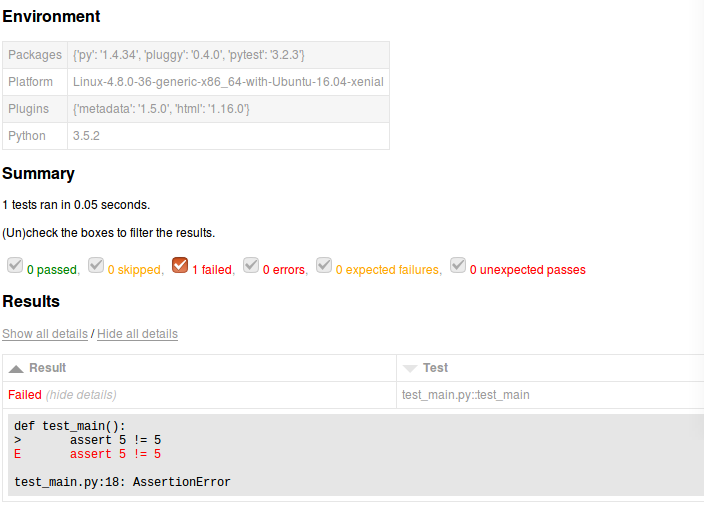

# CD-TM-AT-AD-L3-01-代码级单元自动化测试设计文档

<table border="0" bordercolor="#FFFFFF">
  <tr>
    <th></th>
    <th><h1 style="font-size:150%">能力项  [自动化测试]</h1></th>
  </tr>
</table>

# 前言

软件测试的定义是：在规定的条件下对程序进行操作，以发现程序错误，衡量软件质量，并对其是否能满足设计要求进行评估的过程。自动化测试是使用软件工具和既定程序，对软件所进行的测试活动。

面临需求时间跨度长的困难，如果有自动化测试约束，则其演变一定是一个受控的过程。这恰恰说明了实施自动化测试有非常重要的意义。相对于热补技术这种事后补救技术，自动化测试才是更根本性的质量保障手段。

根据测试金字塔分层模型最底层是单元测试，然后是API接口测试，最后是业务流程自动化测试。其中单元测试是单元软件测试的基础，通过提升单元测试的质量和覆盖率，可以帮助提升软件质量和开发效率。

# 目的

单元测试是在软件开发过程中要进行的最低级别的测试活动，在单元测试活动中，软件的独立单元将在与程序的其他部分相隔离的情况下进行测试。无论是敏捷开发、持续交付，还是测试驱动开发（TDD）都把单元测试作为实现的基石。

本文描述单元测试的要求、特点以及设计方法和工具。

# 金字塔分层模型

在敏捷方法中，持续集成是其基石，持续集成的核心是自动化测试。测试金字塔的概念来自Mike Cohn，在他的书《Succeeding with Agile》中有详细描述：测试金字塔最底层是单元测试，然后是业务逻辑测试，最后是端到端的测试（GUI或CLI）。

<img alt="Testing Layer" src="../../docs/imgs/DevOps流程/Testing_Layer.png"

这个比喻非常形象，它让你一眼就知道测试是需要分层的。它还告诉你每一层需要写多少测试。根据 Mike Cohn 的测试金字塔，建议测试组合应该由以下三层组成（自下往上分别是）：

- 单元测试

- 服务测试

- 用户界面测试

从具体项目的角度来看，测试金字塔似乎过于简单了，因此可能会产生误导。然而，由于其简洁性，在建立适合项目的测试组合时，测试金字塔本身是一条很好的经验法则。Cohn 测试金字塔中提到的两个原则是非常重要的：

- 编写不同粒度的测试

- 层次越高，编写的测试应该越少

为了维持金字塔形状，一个健康、快速、可维护的测试组合应该是这样的：写许多小而快的单元测试。适当写一些更粗粒度的测试，写很少高层次的端到端测试。注意不要让测试组合变成倒三角形，那对维护来说将是一个噩梦，并且跑一遍也需要太多时间。

不要太拘泥于 Cohn 测试金字塔中各层次的名字。事实上，它们可能相当具有误导性：服务测试是一个难以掌握的术语（Cohn 本人说他观察到很多开发人员完全忽略了这一层）。如果项目使用单页应用框架（如 react，angular，ember.js 等），UI 测试显然不必位于金字塔的最高层，完全能够用这些框架对 UI 进行单元测试。

考虑到原始名称的缺点，只要在代码库和团队中通过讨论中达成一致，完全可以为测试层次提供其他名称。

本项目采取单元测试、服务测试、用户界面测试的分层模型。

# 测试工具

单元测试（Unit Test），是一段自动化的代码，用来调动被测试的方法或类，而后验证基于该方法或类的逻辑行为的一些假设。单元测试几乎总是用单元测试框架来写的。它写起来很顺手，运行起来不费时。它是全自动的、可信赖的、可读性强的和可维护的。

框架是一个应用程序的半成品。框架提供了一个可复用的公共结构，程序员可以在多个应用程序之间进行共享该结构，并且可以加以扩展以便满足它们的特定的要求。

单元测试检查一个独立工作单元的行为，在Java程序中，一个独立工作单元经常是一个独立的方法，同时就是一项单一的任务，不直接依赖于其它任何任务的完成。

所有的代码都需要测试。于是在代码中的满足上述定义，并且对独立的工作单元进行测试的行为定义为单元测试过程。

## JUnit

JUnit 是一个 Java编程语言的单元测试框架。JUnit 在测试驱动的开发方面有很重要的发展，是起源于 JUnit 的一个统称为 xUnit 的单元测试框架之一。

在设计之初，JUnit 团队已经为框架定义了3个目标：

- 框架必须帮助我们编写有用的测试

- 框架必须帮助我们创建具有长久价值的测试

- 框架必须帮助我们通过复用代码来降低编写测试的成本

JUnit促进“先测试再编码”，它强调建立测试数据的一段代码可以被测试，先测试再编码实现的想法。这种做法就像是“试了一下，码了一点，测试了一下，代码一点点......”这增加了程序员的工作效率和程序代码的稳定性，减少程序员的压力和花在调试的时间。

Junit的特点：

- JUnit是用于编写和运行测试的开源框架。

- 提供了注释，以确定测试方法。

- 提供断言测试预期结果。

- 提供了测试运行的运行测试。

- JUnit测试让您可以更快地编写代码，提高质量

- JUnit是优雅简洁。它是不那么复杂以及不需要花费太多的时间。

- JUnit测试可以自动运行，检查自己的结果，并提供即时反馈。没有必要通过测试结果报告来手动梳理。

- JUnit测试可以组织成测试套件包含测试案例，甚至其他测试套件。

- Junit显示测试进度的，如果测试是没有问题条形是绿色的，测试失败则会变成红色。

JUnit 的使用方法和术语

| 名称                        | 解释                                                         |
| --------------------------- | ------------------------------------------------------------ |
| Assertions                  | 单元测试实用方法                                             |
| Test Runners                | 测试实例应当怎样被执行（测试运行器）                         |
| Aggregating tests in Suites | 合并多个相关测试用例到一个测试套件中（当运行测试套件时，相关用例就会一起被执行） |
| Test Execution Order        | 指定测试用例运行顺序                                         |
| Exception Testing           | 如何指定测试用例期望的异常                                   |
| Matchers and assertThat     | 如何使用 Hamcrest  的匹配器 (matchers) 和更加具备描述性的断言 (assertions) |
| Ignoring Tests              | 失能类或方法的测试用例                                       |
| Timeout for Tests           | 指定测试用例的最大运行时间（超过这个时间，自动结束测试用例） |
| Parameterized Tests         | 测试用例运行多次，每次都使用不同的参数值                     |
| Assumptions with Assume     | 类似断言，但不会使测试用例失败                               |
| Rules                       | 为测试用例增加Rules（相当于添加功能）                        |
| Theories                    | 使用随机生成的数据使测试用例更加科学严谨                     |
| Test Fixtures               | 为测试方法或者类指定预备的set up和clean up方法               |
| Categories                  | 将测试用例组织起来，方便过滤                                 |

## Go test

go 语言本身内置了一套相对轻量级的测试框架，通过 testing 库和 go test 命令支持单元测试。

在源代码包目录内，所有以_test.go为后缀名的源文件被go test认定为测试文件，这些文件不包含在go build的代码构建中,而是单独通过 go test来编译，执行。

通常对于测试用例，Golang单元测试对文件名和方法名，参数都有很严格的要求。

- 每个测试函数必须导入testing包。测试函数有如下的命名：

```
func TestName(t*testing.T) {

// ...

}
```

·         测试函数的名字必须以Test开头，可选的后缀名必须以大写字母开头：

```
func TestSin(t testing.T) { / ... */ }

func TestCos(t testing.T) { / ... */ }

func TestLog(t testing.T) { / ... */ }
```

- 将测试文件和源码放在相同目录下,并将名字命名为{source_filename}_test.go

假设被测试文件example.go,那么在example.go相同目录下建立一个example_test.go的文件去测试example.go文件里的方法。

通常情况下，将测试文件和源码放在同一个包内。

当运行`go test`命令时，go test 会遍历所有的*_test.go中符合上述命名规则的函数，然后生成一个临时的main包用于调用相应的测试函数，然后构建并运行、报告测试结果，最后清理测试中生成的临时文件。

Go测试用例具有以下特点：

- 测试用例文件不会参与正常源码编译，不会被包含到可执行文件中。

- 测试用例文件使用 go test 指令来执行，没有也不需要 main() 作为函数入口。所有在以_test结尾的源码内以Test开头的函数会自动被执行。

- 单元测试文件 (*_test.go) 里的测试入口必须以 Test 开始，参数为 *testing.T 的函数。一个单元测试文件可以有多个测试入口。

- 使用 testing 包的 T 结构提供的 Log() 方法打印字符串。

## Pytest

Pytest 是 Python 的一种单元测试框架，与 Python 自带的 unittest 测试框架类似，但是比 unittest 框架使用起来更简洁，效率更高。

Pytest 是一个比较成熟且功能完备的 Python 测试框架。其提供完善的在线文档，并有着大量的第三方插件和内置帮助，适用于许多小型或大型项目。Pytest 灵活易学，打印调试和测试执行期间可以捕获标准输出，适合简单的单元测试到复杂的功能测试。还可以执行 nose, unittest 和 doctest 风格的测试用例，甚至 Django 和 trial。支持良好的集成实践， 支持扩展的 xUnit 风格 setup，支持非 python 测试。支持生成测试覆盖率报告，支持 PEP8 兼容的编码风格。

Pytest适合从简单的单元到复杂的功能测试。有很多的第三方插件可以自定义扩展，并且支持 Allure，生成可视化的测试报告和测试结果，并能输出 log 信息。

根据pytest的官方网站介绍，它具有如下特点：

- 非常容易上手，入门简单，文档丰富，文档中有很多实例可以参考

- 能够支持简单的单元测试和复杂的功能测试

- 支持参数化

- 执行测试过程中可以将某些测试跳过，或者对某些预期失败的case标记成失败

- 支持重复执行失败的case

- 支持运行由nose, unittest编写的测试case

- 具有很多第三方插件，并且可以自定义扩展

- 方便的和持续集成工具集成

pytest 能够识别 unittest.TestCase 子类中的测试方法，如果文件名符合 test_*.py 或者 *_test.py 这样的规则。

并且大多数 unittest 的功能都是被支持的，例如：

- @unittest.skip 装饰器;

- setUp/tearDown;

- setUpClass/tearDownClass();

pytest的插件机制提供很多第三方插件方便用例的编写和测试：

- pytest-variables : 通过json文件定义共享变量

- pytest-timeout: 测试超时插件,避免长时间异常运行

- pytest-ordering: 指定测试顺序

- pytest-dependency: 测试依赖关系

- pytest-xdist : 并行/分布式执行测试

- pytest-html : HTML测试报告

- pytest-selenium

# 单元测试设计原则

单元测试目的：

- 带来更高的测试覆盖率

功能测试大约可以覆盖到70%的应用程序代码，如果希望进行的更加深入一点，提供更高的测试覆盖率，那么我们需要编写单元测试了。单元测试可以很容易的模拟错误条件，这一点在功能测试中却很难办到，有些情况下甚至是不可能办到的。单元测试不仅提供了测试，还提供了更多的其它用途，在最后一部分我们将会继续介绍。

- 提高团队效率

在一个项目中，经过单元测试通过的代码，可以称为高质量的代码。这些代码无需等待到其它所有的组件都完成以后再提交，而是可以随时提交，提高的团队的效率。如果不进行单元测试，那么测试行为大多数要等到所有的组件都完成以后，整个应用程序可以运行以后，才能进行，严重影响了团队效率。

- 自信的重构和改进实现

在没有进行单元测试的代码中，重构是有着巨大风险的行为。因为你总是可能会损坏一些东西。而单元测试提供了一个安全网，可以为重构的行为提供信心。同时在良好的单元测试基础上，对代码进行改进实现，对一些修改代码，增加新的特性或者功能的行为，有单元测试作为保障，可以防止在改进的基础上，引入新的Bug。

- 将预期的行为文档化

在一些代码的文档中，示例的威力是众所周知的。当完成一个生产代码的时候，往往要生成或者编写对应的API文档。而如果在这些代码中进行了完整的单元测试，则这些单元测试就是最好的实例。它们展示了如何使用这些API，也正是因为如此，它们就是完美的开发者文档，同时因为单元测试必须与工作代码保持同步，所以比起其它形式的文档，单元测试必须始终是最新的，最有效的。

通过良好设计的单元测试可以帮助实现代码完善的接口设计、正确性、可回归、可测试、完善的调用文档、高内聚、低耦合等目的，单元测试可以具备以下优点：

- 便于后期重构。单元测试可以为代码的重构提供保障，只要重构代码之后单元测试全部运行通过，那么在很大程度上表示这次重构没有引入新的BUG，当然这是建立在完整、有效的单元测试覆盖率的基础上。

- 优化设计。编写单元测试将使用户从调用者的角度观察、思考，特别是使用TDD驱动开发的开发方式，会让使用者把程序设计成易于调用和可测试，并且解除软件中的耦合。

- 文档记录。单元测试就是一种无价的文档，它是展示函数或类如何使用的最佳文档，这份文档是可编译、可运行的、并且它保持最新，永远与代码同步。

- 具有回归性。自动化的单元测试避免了代码出现回归，编写完成之后，可以随时随地地快速运行测试，而不是将代码部署到设备之后，然后再手动地覆盖各种执行路径，这样的行为效率低下，浪费时间。

为了提高开发人员的代码质量，编写高质量的单元测试，要遵守3R（Responsible, Reliable, Repeative）原则，具体含义如下：

- Responsible: 谁开发谁负责测试，在哪里开发就在哪里测试。

- Reliable: 测试case要可靠，并且是值得信赖的，对于底层的任何改动都要能够及时感知。

- Repeative: 所有单元测试用例都要能够重复运行。能够重复运行就能够进行回归测试、覆盖率统计等等。

**如何做到Responsible？**

开发在完成一个方法，或者一个类之后，就要及时得进行单元测试；不能在对应方法或类的调用处进行测试，比如两个模块A、B，A是基础模块，为模块B提供服务，那么所有A模块的单元测试case都应该在A模块的内部进行测试。

**如何做到Reliable?**

为了使得测试用例尽量可靠，就要减少mock的使用（对于第三方的调用可以使用mock），对每层代码的测试都要完全依赖于下层，不能mock下层逻辑。因此引入递进集成的概念，比如测试DAO时要连接真实的数据库，测试Service时要使用真实的DAO、DB， 测试Controller层的代码，要使用真实的Service、DAO、DB，以此类推。这样就可以最大限度的提高case的可靠性。

**如何做到Repeative?**

必须要做到case间完全解耦，没有任何的依赖，这包括和数据库的依赖以及第三方的依赖。case解耦可以通过准备测试数据、mock第三方调用来解决。

# 单元测试设计规范

通过学习《阿里巴巴Java开发手册》整理。

## AIR原则

好的单元测试宏观上来说，具有自动化、独立性、可重复执行的特点。

A: Automatic (自动化)

I：Independent （独立性）

R：Repeatable（可重复）

## 自动化和非交互

单元测试应该是全自动执行的，并且非交互式的。单元测试中不准使用System.out来进行人肉验证，必须使用assert来验证结果。

## 独立性

为了保证单元测试稳定可靠且便于维护，单元测试用例之间决不能互相调用，也不能依赖执行的先后次序。

## 重复性

单元测试是可以重复执行的，不能受到外界环境的影响。单元测试通常会被放到持续集成中，每次有代码check in时单元测试都会被执行。如果单元测试对外部环境（网络、服务、中间件等）有依赖，容易导致持续集成机制不可用。

## 测试重点模块

核心业务、核心应用、核心模块的增量代码确保单元测试通过 

## 代码目录

**Java**

单元测试代码必须写在如下工程目录：src/test/java，不允许写在业务代码目录下。

说明：源码构建时会跳过此目录，而单元测试框架默认是扫描此目录。

**Go**

在 golang 中编写单元测试时，在同需测试的源文件目录下增加XXX_test.go(XXX是源文件名)文件。

**Pytest**

pytest编写单元测试时，在同需测试的源文件目录下增加test_XXX.py(XXX是源文件名)文件。

## 质量门禁

单元测试的基本目标：语句覆盖率达到50%，核心模块的语句覆盖率和分支覆盖率都要达到100%。每次新提交代码的单元测试覆盖率不小于代码仓库里代码的测试覆盖率。

在工程规约的应用分层中提到的DAO层，Manager层，可重用度高的Service，都应该进行单元测试。

 

## 编写原则

遵守BCDE原则，以保证被测试模块的交付质量。

B：Border，边界值测试，包括循环边界、特殊取值、特殊时间点、数据顺序等

C：Correct，正确的输入，并得到预期的结果

D：Design，与设计文档相结合，来编写单元测试

E：Error，强制错误信息输入（如：非法数据、异常流程、非业务允许输入等），并得到预期的结果

## 数据库

不能假设数据库里的数据是存在的，或者直接操作数据库把数据插入进去，请使用程序插入或者导入数据的方式来准备数据。

和数据库相关的单元测试，可以设定自动回滚机制，不给数据库造成脏数据 。或者对单元测试产生的数据有明确的前后缀标识

## 不可测的代码

建议做必要的重构，使代码变得可测，避免为了dao测试要求而书写不规范的测试代码。

## 设计评审

建议在设计评审阶段，开发人员和测试人员一起确定单元测试范围，单元测试最好覆盖所有测试用例（UC）。

# 单元测试用例编写 

## Junit

**创建一个类**

WORKSPACE 路径下创建一个名为 MessageUtil.java 的类用来测试。

```java
/*
* This class prints the given message on console.
*/
public class MessageUtil {

   private String message;

   //Constructor
   //@param message to be printed
   public MessageUtil(String message){
      this.message = message;
   }

   // prints the message
   public String printMessage(){
      System.out.println(message);
      return message;
   }   
}

```

**创建 Test Case 类**

- 创建一个名为 TestJunit.java 的测试类。

- 向测试类中添加名为 testPrintMessage() 的方法。

- 向方法中添加 Annotaion @Test。

- 执行测试条件并且应用 Junit 的 assertEquals API 来检查。

在WORKSPACE路径下创建一个文件名为 TestJunit.java 的类

```java
import org.junit.Test;
import static org.junit.Assert.assertEquals;
public class TestJunit {

   String message = "Hello World";  
   MessageUtil messageUtil = new MessageUtil(message);

   @Test
   public void testPrintMessage() {
      assertEquals(message,messageUtil.printMessage());
   }
}

```

**创建 Test Runner 类**

- 创建一个 TestRunner 类

- 运用 JUnit 的 JUnitCore 类的 runClasses 方法来运行上述测试类的测试案例 

- 获取在 Result Object 中运行的测试案例的结果

- 获取 Result Object 的 getFailures() 方法中的失败结果

- 获取 Result object 的 wasSuccessful() 方法中的成功结果

WORKSPACE 路径下创建一个文件名为 TestRunner.java 的类来执行测试案例

```java
import org.junit.runner.JUnitCore;
import org.junit.runner.Result;
import org.junit.runner.notification.Failure;

public class TestRunner {
   public static void main(String[] args) {
      Result result = JUnitCore.runClasses(TestJunit.class);
      for (Failure failure : result.getFailures()) {
         System.out.println(failure.toString());
      }
      System.out.println(result.wasSuccessful());
   }
}   

```

**编译**

用 javac 编译 MessageUtil、Test case 和 Test Runner 类。

```java
/WORKSPACE/javac MessageUtil.java TestJunit.java TestRunner.java
```

**测试运行**

现在运行 Test Runner,它可以运行在所提供的 Test Case 类中定义的测试案例。

```java
/WORKSPACE/java TestRunner
```

**检查运行结果**

```java
Hello World
true
```

**错误断言**

现更新 WORKSPACE 路径下的 TestJunit，并且检测失败。改变消息字符串。

```java
import org.junit.Test;
import static org.junit.Assert.assertEquals;
public class TestJunit {

   String message = "Hello World";  
   MessageUtil messageUtil = new MessageUtil(message);

   @Test
   public void testPrintMessage() {
      message = "New Word";
      assertEquals(message,messageUtil.printMessage());
   }
}

```

让我们保持其他类不变，再次尝试运行在 Test Case 类中提供的即将运行测试案例的 Test Runner，检查运行结果。

```java
Hello World
testPrintMessage(TestJunit): expected:<[New Wor]d> but was:<[Hello Worl]d>
false

```

**JUnit 的各种断言**

为了进行验测试验证，使用了由 JUnit 的 Assert 类提供的 assert 方法。正如在上面的例子中使用的那样，在测试类中静态的导入这些方法，同时还有更多的方法以供使用，如下列出一些流行的 assert 方法。

| 方法 Method                      | 检查条件                                |
| -------------------------------- | --------------------------------------- |
| assertEquals(msg, a, b)          | a == b，msg可选，用来解释失败的原因     |
| assertNotEquals(msg, a, b)       | a != b，msg可选，用来解释失败的原因     |
| assertTrue(msg, x )              | x 是真，msg可选，用来解释失败的原因     |
| assertFalse(msg, x)              | x 是假，msg可选，用来解释失败的原因     |
| assertSame(msg, a, b)            | a 不是 b，msg可选，用来解释失败的原因   |
| assertNull(msg, x)               | x 是null，msg可选，用来解释失败的原因   |
| assertNotNull(msg, x)            | x 不是null，msg可选，用来解释失败的原因 |
| assertThat(msg, actual, matcher) | 用匹配器进行断言                        |

## Go test

由于go test命令只能在一个相应的目录下执行所有文件，所以新建一个项目目录gotest，所有的代码和测试代码都在这个目录下。

gotest.go：这个文件创建了一个包，里面有一个函数实现了除法运算:

```java
package gotest

import (
    "errors"
)

func Division(a, b float64) (float64, error) {
    if b == 0 {
        return 0, errors.New("除数不能为0")
    }

    return a / b, nil
}

```

gotest_test.go：这是单元测试文件，必须符合下面的这些原则

- 文件名必须是_test.go结尾的，这样在执行go test的时候才会执行到相应的代码

- 必须import testing这个包

- 所有的测试用例函数必须是Test开头

- 测试用例会按照源代码中写的顺序依次执行

- 测试函数TestXxx()的参数是testing.T，可以使用该类型来记录错误或者是测试状态

- 测试格式：func TestXxx (t *testing.T)，Xxx部分可以为任意的字母数字的组合，但是首字母不能是小写字母[a-z]，例如Testintdiv是错误的函数名。

- 函数中通过调用testing.T的Error, Errorf, FailNow, Fatal, FatalIf方法，说明测试不通过，调用Log方法用来记录测试的信息。

下面是测试用例的代码：

```java
package gotest

import (
    "testing"
)

func Test_Division_1(t *testing.T) {
    if i, e := Division(6, 2); i != 3 || e != nil { //try a unit test on function
        t.Error("除法函数测试没通过") // 如果不是如预期的那么就报错
    } else {
        t.Log("第一个测试通过了") //记录一些你期望记录的信息
    }
}

func Test_Division_2(t *testing.T) {
    t.Error("就是不通过")
}

```

在项目目录下面执行go test，就会显示如下信息：

```
--- FAIL: Test_Division_2 (0.00 seconds)
    gotest_test.go:16: 就是不通过
FAIL
exit status 1
FAIL    gotest  0.013s

```

从这个结果显示测试没有通过，因为在第二个测试函数中写死了测试不通过的代码t.Error，那么第一个函数执行的情况怎么样呢？默认情况下执行go test是不会显示测试通过的信息的，需要带上参数go test -v，这样就会显示如下信息：

```java
=== RUN Test_Division_1
--- PASS: Test_Division_1 (0.00 seconds)
    gotest_test.go:11: 第一个测试通过了
=== RUN Test_Division_2
--- FAIL: Test_Division_2 (0.00 seconds)
    gotest_test.go:16: 就是不通过
FAIL
exit status 1
FAIL    gotest  0.012s

```

上面的输出详细的展示了这个测试的过程，测试函数Test_Division_1测试通过，而测试函数Test_Division_2测试失败了，最后得出结论测试不通过。

接下来把测试函数2修改成如下代码：

```java
func Test_Division_2(t *testing.T) {
    if _, e := Division(6, 0); e == nil { //try a unit test on function
        t.Error("Division did not work as expected.") // 如果不是如预期的那么就报错
    } else {
        t.Log("one test passed.", e) //记录一些你期望记录的信息
    }
}   

```

执行go test -v，就显示如下信息，测试通过了：

```shell
=== RUN Test_Division_1
--- PASS: Test_Division_1 (0.00 seconds)
    gotest_test.go:11: 第一个测试通过了
=== RUN Test_Division_2
--- PASS: Test_Division_2 (0.00 seconds)
    gotest_test.go:20: one test passed. 除数不能为0
PASS
ok      gotest  0.013s

```

## Pytest

**基本使用**

```shell
usage: py.test [options] [file_or_dir] [file_or_dir] [...]
```

用例查找规则

如果不带参数运行 pytest，那么其先从配置文件(pytest.ini，tox.ini，setup.cfg)中查找配置项 testpaths 指定的路径中的 test case，如果没有则从当前目录开始查找，否者，命令行参数就用于目录、文件查找。查找的规则如下：

- 查找指定目录中以 test 开头的目录

- 递归遍历目录，除非目录指定了不同递归

- 查找文件名以 test_ 开头的文件

- 查找以 Test 开头的类(该类不能有 init 方法)

- 查找以 test_ 开头的函数和方法并进行测试

如果要从默认的查找规则中忽略查找路径，可以加上 --ingore 参数，例如：

```shell
pytest --ignore=tests/test_foobar.py
```

**部分参数介绍**

```yaml
py.test --version               查看版本
py.test --fixtures, --funcargs  查看可用的 fixtures
pytest --markers                查看可用的 markers
py.test -h, --help              命令行和配置文件帮助

# 失败后停止
py.test -x           首次失败后停止执行
py.test --maxfail=2  两次失败之后停止执行

# 调试输出
py.test -l, --showlocals  在 traceback 中显示本地变量
py.test -q, --quiet       静默模式输出
py.test -v, --verbose     输出更详细的信息
py.test -s                捕获输出, 例如显示 print 函数的输出
py.test -r char           显示指定测试类型的额外摘要信息
py.test --tb=style        错误信息输出格式
    - long    默认的traceback信息格式化形式
    - native  标准库格式化形式
    - short   更短的格式
    - line    每个错误一行

# 运行指定 marker 的测试
pytest -m MARKEXPR

# 运行匹配的测试
py.test -k stringexpr

# 失败时调用 PDB
py.test --pdb

```

**例子**

一个简单的例子，命名为test_pytest1.py

```java
def funx(x):
    return x + 1

def test_answer():
    assert funx(2) == 5

```

**运行**

进入脚本运行 pytest test_pytest1.py

```txt
=========================== test session starts ============================
platform linux -- Python 3.5.2, pytest-3.2.3, py-1.4.34, pluggy-0.4.0
rootdir: /home/demo, inifile:
collected 1 item                                                               

test_pytest1.py F

============================= FAILURES ===============================
_________________________________ test_answer __________________________________

    def test_answer():
>      assert funx(2) == 5
E      assert 3 == 5
E        +  where 3 = funx(2)

test_pytest1.py:8: AssertionError
========================= 1 failed in 0.02 seconds ===========================

```

使用-q参数，运行pytest -q test_pytest1.py

```txt
F
============================= FAILURES ===============================
_________________________________ test_answer __________________________________

    def test_answer():
>      assert funx(2) == 5
E      assert 3 == 5
E        +  where 3 = funx(2)

test_pytest1.py:8: AssertionError
1 failed in 0.02 seconds

```

两种运行结果有一点差异，就是少了一些版本信息。

**一个测试类中创建多个测试用例**

```java
class TestClass:
    def test_one(self):
        x = "this"
        assert "s" in x

    def test_two(self):
        x = "hello"
        assert x == "hi"

```

**测试报告**

运行python3 -m pytest test_main.py --html=report/test_main.html产生测试报告。


