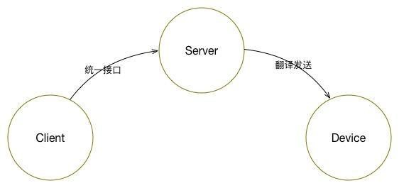
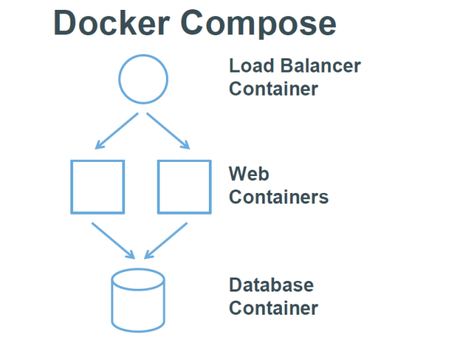
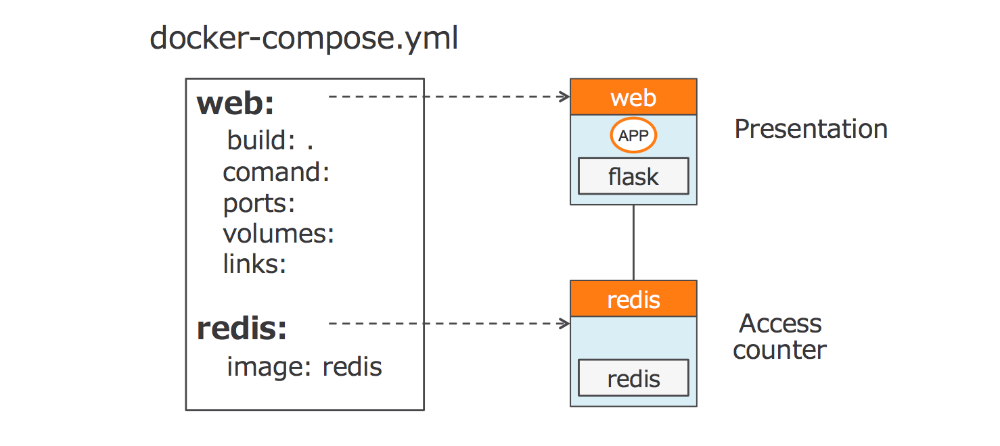
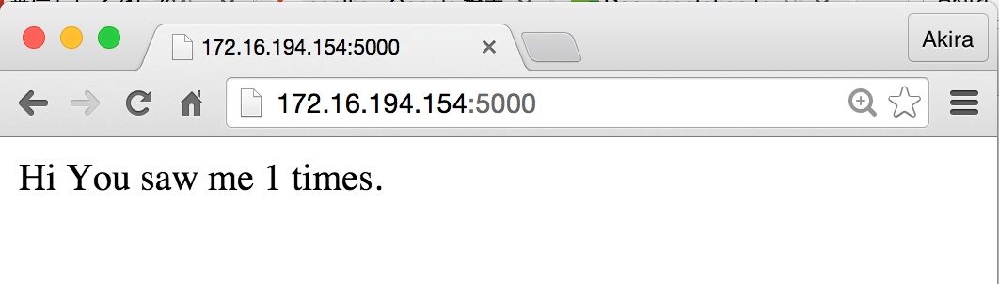
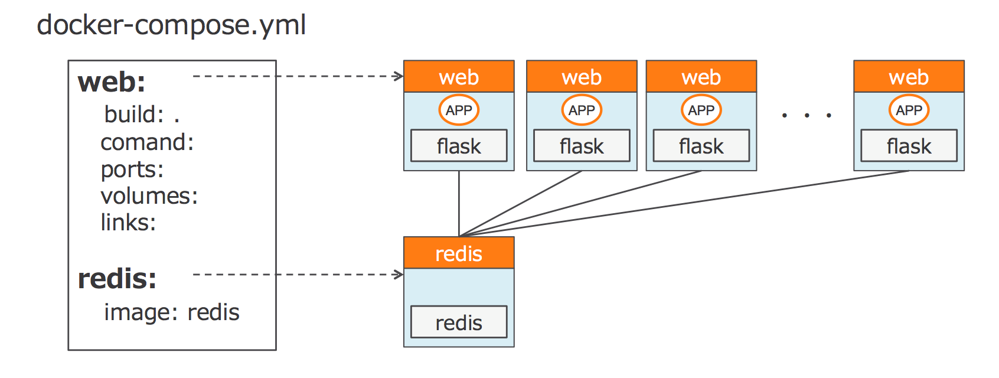
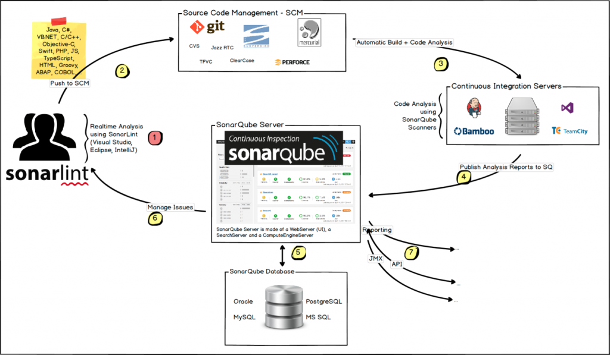

# CD-TM-AT-AD-L4-01-非功能自动化测试设计文档

## 能力项  [自动化测试]

# 前言

非功能的测试领域包括了性能，负载，安全，可靠性和其他很多方面。非功能测试有时也被称作行为测试或质量测试。非功能测试的众多属性的一个普遍特征是一般不能直接测量。这些属性是被间接地测量，例如用失败率来衡量可靠性或圈复杂度，用设计审查指标来评估可测性。

国际化标准组织（ISO）在ISO9216和ISO25000：2005中定义了几个非功能属性。这些属性包括：

- Reliability可靠性：软件使用者期望软件能够正常运行。可靠性是度量软件如何在主流情形和非预期情形下维持它的功能，有时也包括软件出错时的自恢复能力。

- Usability可用性：如果用户不明白应该如何使用，那么，既是零差错的软件也会毫无用处。可用性测量的是用户学习和控制软件以达到用户需求的难易程度。进行可用性研究，重视顾客反馈意见和对错误信息和交互内容的检查都能提高可用性。

- Maintainability可维护性：可维护性描述了修改软件而不引入信错误所需的工作量。

- Portability可移植性：可移植性指一种计算机上的软件转置到其它计算机上的能力。软件移植是实现功能的等价联系，而不是等同联系。从狭义上讲，是指可移植软件应独立于计算机的硬件环境；从广义上讲，可移植软件还应独立于计算机的软件，即高级的标准化的软件，它的功能与机器系统结构无关，可跨越很多机器界限。

# 目的

非功能测试是针对非功能性需求而进行的测试类型。在功能测试中不考虑大多数标准，因此它用于检查系统的准备情况。非功能性需求倾向于反映产品质量的要求，特别是在其用户的适用性方面。它可以在功能测试完成后启动。非功能性测试可以通过使用自动化测试工具实现，在特定约束下测试与任何特定功能或用户操作无关的软件属性，如性能，可伸缩性，安全性或应用程序行为。非功能性测试对客户和用户对产品的满意度有很大影响。非功能性测试应以可测试的方式表达，而不是“系统应该快速”或“系统应该易于操作”，这是不可测试的。

一般来说，很多软件项目及产品，其在非功能性需求上的成本，难度和工作量，要超过功能性需求的。在特定的软件领域，例如网站、金融、电信领域，其非功能性需求实现的重要性，工作量，技术难度要远大于功能性需求的实现。功能性的需求的实现，其实在大多数情况下，依赖于业务实践，而非功能性需求的实现，挑战技术能力的重要课题。

非功能性需求中，性能/容量，以及安全的要求，是技术挑战最多，内涵最丰富，成本最高，最值得关注的领域，当然，现在易用性（UE）也是一个极度收到重视的领域。

一般情况下，需要通过以下一种或几种自动化非功能性测试来保证项目的交付质量。

- 兼容性测试：是指测试软件在特定的硬件平台上、不同的应用软件之间、不同的操纵系统平台上、不同的网络等环境中，软件之间是否能够正确地交互和共享信息。兼容性对于软件的意义取决于开发小组用什么来定义，以及软件运行的系统要求的兼容性级别。

- 安全性测试：测试包括传输加密，存储加密，可破解性，以及各种未被授权的用户行为如何防范和控制等，在安全性的考虑上，需要综合考虑架构层、网络层和应用层的安全，还有一个非常重要的因素就是安全的ROI,这里不单单指投入的金钱，更指投入的资源，因为，往往安全性和易用性可能是成反比的，所以，灵活适用是安全的一个重要前提。

- 可靠性测试：测试在规定的一段时间和条件下软件维持其性能水平的能力有关的一组属性。具体包括：弹性伸缩，故障隔离和失效恢复等内容。

- 可移植性测试：简单来说是软件是否具备在不同的环境中转移的能力；

- 性能测试：关注点是业务量与资源容量的占比，以及业务流量的合理分配，对这一块提出的要求是宜尽量贴近适应实际的生产需求，并且具备应对业务量的变化（快速增长或者下降）的能力，开发和运维过程中都存在，并且是一个动态的非功能需求点。性能测试类型包括压力测试、负载测试，强度测试，容量测试等。因为各属性之间在范围上有重叠，很多非功能属性的名字是可以通用的。

- 本地化测试：本地化就是将软件版本语言进行更改，本地化测试的对象是软件的本地化版本。本地化测试的目的是测试特定目标区域设置的软件本地化质量。本地化测试的环境是在本地化的操作系统上安装本地化的软件。从测试方法上可以分为基本功能测试，安装/卸载测试，当地区域的软硬件兼容性测试。测试的内容主要包括软件本地化后的界面布局和软件翻译的语言质量，包含软件、文档和联机帮助等部分。

# 兼容性测试

兼容性测试是指测试软件在特定的硬件平台上、不同的应用软件之间、不同的操作系统平台上、不同的网络等环境中是否能够很友好的运行的测试。移动端目前碎片化十分严重，尤其是安卓设备。安卓设备碎片化、品牌碎片化，大家熟知的安卓品牌都有好多家，每家可能还有定制的系统，都给我们适配带来了不小的挑战。除了上面的碎片化，当然还有系统版本碎片化，屏幕碎片化等，为了给用户更好的用户体验，做APP的兼容性测试，还是非常有必要的。每一款应用在上线之前，都应做一轮覆盖一定机型量的兼容性测试。在产品面对用户之前，尽量筛选并解决所有影响用户体验的问题。

建议使用移动测试云平台，建立真机测试设备池。兼容性测试平台以公开销售机型排名为依据，确保采用用户量占比最高。每季进行新机型更新，保持机型库中的机型全都是当下的最热机型。

通过移动测试云平台，将移动真机的UI自动化的测试用例发布到不同机型上做测试，并将多种机型的测试报告作为移动兼容性测试是否通过的依据并进行反馈。


## Appium

Appium是一个开源的自动化测试工具，其支持iOS和安卓平台上的原生的，基于移动浏览器的，混合的应用。

- “移动原生应用”是指那些用iOS或者 Android SDK 写的应用（Application简称app）。

- “移动web应用”是指使用移动浏览器访问的应用（appium支持iOS上的Safari和Android上的 Chrome）。

- “混合应用”是指原生代码封装网页视图——原生代码和 web 内容交互。比如，像 Phonegap，可以帮助开发者使用网页技术开发应用，然后用原生代码封装，这些就是混合应用。

使用Appium带来的好处：

- Appium是一个跨平台的工具：它允许测试人员在不同的平台（iOS，Android）使用同一套API来写自动化测试脚本，增加了iOS和Android测试套件间代码的复用性。

- Appium支持Selenium WebDriver支持的所有语言，如java、Object-C、JavaScript、Php、Python、Ruby、C#、Clojure，或者Perl语言，更可以使用Selenium WebDriver的Api。Appium支持任何一种测试框架.Appium实现了真正的跨平台自动化测试。

Appium 的架构是一个用Node.js编写的HTTP server，它创建、并管理多个 WebDriver sessions 来和不同平台交互，如 iOS ，Android等等。



Appium 开始一个测试后，就会在被测设备（手机）上启动一个 server ，监听来自 Appium server的指令. 每种平台像 iOS 和Android都有不同的运行、和交互方式。所以Appium会用某个桩程序“侵入”该平台，并接受指令，来完成测试用例的运行。

Appium类库封装了标准Selenium客户端类库，为用户提供所有常见的JSON格式selenium命令以及额外的移动设备控制相关的命令，如多点触控手势和屏幕朝向。

Appium客户端类库实现了Mobile JSON Wire Protocol（一个标准协议的官方扩展草稿）和W3C WebDriver spec（一个传输不可预知的自动化协议，该协议定义了MultiAction 接口）的元素。

Appium服务端定义了官方协议的扩展，为appium 用户提供了方便的接口来执行各种设备动作，例如在测试过程中安装/卸载App。这就是为什么我们需要appium特定的客户端，而不是通用的Selenium 客户端。当然，Appium 客户端类库只是增加了一些功能，而实际上这些功能就是简单的扩展了Selenium 客户端，所仍然可以用来运行通用的Selenium会话。

Appium选择了Client/Server的设计模式。只要client能够发送http请求给server，那么的话client用什么语言来实现都是可以的，这就是Appium及Selenium(WebDriver)如何做到支持多语言的原因；

Appium扩展了WebDriver的协议，不用重新去实现。这样的好处是以前的WebDriver API能够直接被继承过来，以前的Selenium（WebDriver）各种语言的binding都可以拿来就用，省去了为每种语言开发一个client的工作量。

| **语言/框架**        | **Github地址**                                               |
| -------------------- | ------------------------------------------------------------ |
| Ruby                 | <https://github.com/appium/ruby_lib>                         |
| Python               | <https://github.com/appium/python-client>                    |
| Java                 | <https://github.com/appium/java-client>                      |
| JavaScript (Node.js) | <https://github.com/admc/wd>                                 |
| Objective C          | <https://github.com/appium/selenium-objective-c>             |
| PHP                  | <https://github.com/appium/php-client>                       |
| C# (.NET)            | <https://github.com/appium/appium-dotnet-driver>             |
| RobotFramework       | <https://github.com/jollychang/robotframework-appiumlibrary> |

## AirTest

Airtest Project是网易游戏内部工具团队开发并开源的一款UI自动化测试工具，曾经获得谷歌力挺。它主要基于以下两项技术：

- **基于图像识别**

Airtest可以通过屏幕截图的方式来获取我们想要操作的区域。例如对一些按钮进行测试时，我们可以不再写复杂的代码去获取按钮的信息，直接对按钮进行截图，把截图放在程序中，程序就会自动识别到截图中的位置以访问该按钮。

- **基于Poco控件**

Airtest可以通过控件的name、id等信息的来定位目标控件，再调用函数方法对控件进行不同的操作。

Airtest Project 主要包含了三部分：Airtest IDE、Airtest 和 Poco。其中，Airtest IDE 是 GUI 工具，Airtest 和 Poco 是两个底层自动化测试框架。

AirtestIDE 是一个跨平台、多端（Windows、web、android、ios、游戏）的UI自动化测试编辑器。支持自动化脚本录制、一键回放、报告查看，一站式解决支持基于图像识别的Airtest框架，适用于所有Android和Windows游戏，会截图就能写脚本支持基于UI控件搜索的Poco框架，适用于Unity3d，Cocos2d与Android、ios App、web能够运行在Windows和MacOS上网易内部已成功应用在数十个项目上，还可以利用手机集群进行大规模自动化测试。

Airtest具有以下关键特性：

- 基于图像识别的 Airtest 框架，适用于 Android 和 Windows 上的游戏和 APP，且无需开发者在项目代码上的额外支持

- 基于 UI 控件搜索的 Poco 框架，使用 Unity3d、Cocos2d 或安卓原生 App 开发的项目在脚本制作上具有极大的便利性

- 自动化脚本录制、一键回放、报告查看，轻而易举实现自动化测试流程

- 可利用手机集群进行大规模自动化测试，为APP 快速实现兼容性测试

具体来说，通过基于图像识别的 Airtest 框架，使用者无需接入代码，只要在设备窗口操作手机，代码即会在代码窗口自动生成。如果开发者认为图标不够精确，还可以通过手动框选图标或是其他方式来生成模拟输入语句。

而基于 UI 控件搜索的 POCO 框架，可以直接获取 UI 结构，检视 UI 控件。它支持 Unity3D、Cocos2dx 等主流游戏引擎及安卓原生 App，开发者也可以通过扩展 SDK 支持其他游戏引擎或任意 UI 系统。在实际测试过程中，Airtest IDE 可以为测试人员定位异常测试点，回放每一个操作步骤，最后还会生成一份报告，以方便测试人员排查细节错误。

借助 Airtest IDE，测试人员可录制自动化测试脚本、一键生成测试报告，提供相对完整的问题操作步骤、现场日志、截图和性能数据的记录，帮助开发成员快速定位和解决问题，实现有效沟通。

此外，Airtest IDE 中录制和运行的代码都是基于 Python 2.7 语言，新手上手比较容易，熟练的开发者也可以通过添加第三方库和工具增强自己的脚本。同时，这项工具还可以与持续集成相结合，甚至以此技术为基础搭建云测试平台。在以往的测试过程中，开发者往往需要在几百台安卓手机上测试游戏的兼容性。但通过 Airtest IDE 可视化、易于编辑的界面与功能，开发者只需录制一次测试脚本即可实现多端运行，这大幅度减少了人力及时间成本。

Airtest希望提供平台无关的API，让测试代码可以运行在不同平台的应用上。

- 使用connect_device 来连接任意Android设备或者Windows窗口。

- 使用 模拟操作 的API来测试App。

- 通过声明断言 来验证测试结果。

```java
from airtest.core.api import *

# 通过ADB连接本地Android设备
connect_device("Android:///")
install("path/to/your/apk")
start_app("package_name_of_your_apk")
touch("image_of_a_button.png")
swipe("slide_start.png", "slide_end.png")
assert_exists("success.png")
keyevent("BACK")
home()
uninstall("package_name_of_your_apk")

```

使用AirtestIDE可以非常轻松地录制一个测试脚本并保存为 .air 目录结构。 Airtest命令行则能够脱离IDE，在不同宿主机器和被测设备上运行测试脚本。

```python
python -m airtest run <path to your air dir> --device Android:///
python -m airtest run <path to your air dir> --device Windows:///?title_re=Unity.*

```

# 可靠性测试

可伸缩性(可扩展性)是一种对软件系统计算处理能力的设计指标，高可伸缩性代表一种弹性，在系统扩展成长过程中，软件能够保证旺盛的生命力，通过很少的改动甚至只是硬件设备的添置，就能实现整个系统处理能力的线性增长，实现高吞吐量和低延迟高性能。

可伸缩性和纯粹性能调优有本质区别， 可伸缩性是高性能、低成本和可维护性等诸多因素的综合考量和平衡，可伸缩性讲究平滑线性的性能提升，更侧重于系统的水平伸缩，通过廉价的服务器实现分布式计算；而普通性能优化只是单台机器的性能指标优化。他们共同点都是根据应用系统特点在吞吐量和延迟之间进行一个侧重选择，当然水平伸缩分区后会带来CAP定理约束。

可靠性的非功能性测试和云计算的特性有着必然的关系，同时也和服务的可靠性，服务的计量和治理有着密切的关系。简单来说要保证云服务的可靠性，可用性，可管理性，必须具有一些云化后的非功能性指标，否则业务功能再好用，不可靠，对用户来说是没有保障的，可靠性云化的非功能指标，否则软件只是搬到云端，并不具备任何云计算的特性，也就是假云。

云服务的可靠性测试包括以下关键点：

- 弹性伸缩

- 服务无状态

- 故障转移/隔离

因为先进的云服务应用采用容器作为主要技术，可靠性测试服务可以利用docker-compose作为测试工具编写测试用例并生成测试报告。

## docker-compose

Docker-Compose是Docker的一种编排服务，是一个用于在Docker上定义并运行复杂应用的工具，可以让用户在集群中部署分布式应用。

通过Docker-Compose用户可以很容易地用一个配置文件定义一个多容器的应用，然后使用一条指令安装这个应用的所有依赖，完成构建。Docker-Compose解决了容器与容器之间如何管理编排的问题。



docker compose是一个工具集，用于定义和运行同时依赖于多个docker容器的应用程序。在使用docker compose时，通常会用到YAML文件来配置你的应用程序服务。然后通过该配置文件，你就可以很简单的创建和启动配置中的所有服务。

使用docker compse通常有如下三个步骤：

- 使用Dockerfile定义应用程序运行环境，这使得可以很方便的扩充移植

- 在docker-compose.yml文件中定义应用程序所依赖的service，这使得在一个隔离的环境中所有的服务得以运行

- 运行docker compose up命令来启动应用服务程序

docker compose有相应的命令来管理应用程序的整个生命周期：

- Start、Stop和Rebuild services

- 查看所运行服务的状态

- 打印出所运行服务的日志

- 在Service上运行一次性命令

采用Docker-compose来测试弹性伸缩和故障隔离。下面是一个简单的例子：

**建立简单的Docker Compose**

1. 在~workspace/docker下建立“compose” 目录

```
 	$ mkdir -p ~/workspace/docker/compose  
 	$ cd ~/workspace/docker/compose
```

2. 建立一个应用

```
$ vi app.py
 	from flask import Flask from redis import Redis import os app = Flask(__name__) redis = Redis(host='redis', port=6379)  @app.route('/') def hello():     redis.incr('counter')     return'Hi! You saw me %s times.'% redis.get('counter')  if __name__ == "__main__":     app.run(host="0.0.0.0", debug=True)
```

每次使用Web浏览器访问时，此应用程序的计数器会以redis的访问次数递增。 

3. 建立requirements文件

```
$ vi requirements.txt
  flask 
  redis
   
```

4. 建立 Dockerfile

```
 	$ vi Dockerfile
 	FROM python:2.7 
 	ADD . /code WORKDIR /code 
 	RUN pip install -r requirements.txt

```

5. 建立 docker-compose.yml

   ```yaml
   $ vi docker-compose.yml
    	web:
       	build: .
           command: python app.py
           ports:         
           	- "5000:5000"     
           volumes: 
           	- .:/code     
           links:         
           	- redis 
        redis:
        	 image: redis
   
   
   ```

   在这个例子中，定义了Multi-Container应用程序，它在compose中有`web`和`redis`容器。

   

6. 运行Multi-Container应用

   ```yaml
    	$ docker-compose up -d 
    	Pulling redis (redis:latest)... 
    	latest: Pulling from library/redis
       ba249489d0b6:Pull complete 
       :
       Status:Downloaded newer image for redis:latest
       Creating compose_redis_1...
       :
       Building web...
       Step 0 : FROM python:2.7
       2.7: Pulling from library/python
       843e2bded498: Pull complete
       8c00acfb0175: Pull complete
       :
       Successfully built 1622bc6ab5bb
       Creating compose_web_1...
   
   
   ```

   7. 检查运行的容器

      ```
       $ docker-compose ps
       Name            Command                     State  Ports
       compose_redis_1 /entrypoint.sh redis-server  Up    6379/tcp
       compose_web_1   python app.py                Up    0.0.0.0:5000->5000/tcp
      
      ```

      可以看到Docker Compose启动了2个容器。 compose_web_1容器的端口5000绑定到Docker Host的端口5000（vm-appcat01）。

   8. 检查vm-appcat01的IP地址
   
      ```
      $ docker-machine ls
       NAME        ACTIVE DRIVER            STATE   URL                       SWARM    vm-appcat01 *       vmwareappcatalyst  Running  tcp://172.16.194.154:2376
      
      ```
   
   9. 通过浏览器访问172.16.194.154:5000



   10.  再次访问，计数器增加1.（redis上的计数器增加）
   11.  显示日志

```
$ docker-compose logs
docker-compose logs
Attaching to compose_web_1, compose_redis_1
web_1   |  * Running on http://0.0.0.0:5000/ (Press CTRL+C to quit)
:

```

**测试Case设计**

-  **服务扩展测试**

1. 用docker-compose扩展的Web应用程序。

2. 编辑docker-compose.yml

```
$ vi docker-compose.yml
web:
	build: .     
	command: python app.py
    ports:
        - "5000"     
    volumes:
		- .:/code  
	links:     
		- redis 
redis:     image: redis
 	
```

在前面示例中，将docker host的端口5000绑定到Web容器的端口5000。
（ - “5000：5000”）这会阻止扩展Web容器，因为第一个Web容器正在使用docker主机上的端口5000。 所以这次需要设置为 - “5000”。 这会将“web”容器的端口5000绑定到docker
host的任意端口。

3. 使用Docker-compose启动容器

   ```
   $ docker-compose up -d
   Creating compose_redis_1... 
   Building web... 	
   ```

4. 检查运行的容器

   ```
   $ docker-compose ps  Name            Command                     State  Ports compose_redis_1 /entrypoint.sh redis-server  Up    6379/tcp 
   compose_web_1   python app.py                Up    0.0.0.0:32768->5000/tcp
   ```

   请注意compose_web_1的端口号。 容器的端口5000绑定到Docker主机的32768端口（vm-appcat01）。

   也可以使用docker-machine ls命令。

5. 现在将Web容器扩展1个（使其成为2）。

   ```
   $ docker-compose scale web=2
    Creating and starting 2... done
   ```

6. ```
   $ docker-compose ps  Name            Command                     State  Ports compose_redis_1 /entrypoint.sh redis-server  Up    6379/tcp
   compose_web_1   python app.py                Up    0.0.0.0:32768->5000/tcp
   compose_web_2   python app.py                Up    0.0.0.0:32769->5000/tcp
   ```

   可以看到有两个“web”容器正在运行。

7. 使用API测试用例或者UI测试用例，检查应用服务的可用性进行测试。

- **服务扩展稳定性测试**

   1. 将Web容器扩展到10个。
   
      ```
      docker-compose scale web=10
      Creating and starting 3... done
      Creating and starting 4... done
      Creating and starting 5... done
      Creating and starting 6... done
      Creating and starting 7... done
      Creating and starting 8... done
      Creating and starting 9... done
      Creating and starting 10... done
      ```
   
      现在有10个Web容器正在运行。
   
      

2. 检查正在运行的容器

   ```
   docker-compose ps
   Name                     Command             State     Ports
   compose_redis_1  /entrypoint.sh redis-server Up     6379/tcp 
   compose_web_1    python app.py               Up     0.0.0.0:32769->5000/tcp compose_web_10   python app.py               Up     0.0.0.0:32770->5000/tcp compose_web_2    python app.py               Up     0.0.0.0:32768->5000/tcp compose_web_3    python app.py               Up     0.0.0.0:32774->5000/tcp compose_web_4    python app.py               Up     0.0.0.0:32773->5000/tcp compose_web_5    python app.py               Up     0.0.0.0:32777->5000/tcp compose_web_6    python app.py               Up     0.0.0.0:32771->5000/tcp compose_web_7    python app.py               Up     0.0.0.0:32772->5000/tcp compose_web_8    python app.py               Up     0.0.0.0:32775->5000/tcp compose_web_9    python app.py               Up     0.0.0.0:32776->5000/tcp
   ```

3. 使用API测试用例或者UI测试用例，检查应用服务的可用性进行测试。

- **服务收缩测试**

1.  现在进行服务收缩，将“web”容器设为3，redis设为2。

   ```
   $ docker-compose scale web=3 redis=2 
   Stopping compose_web_4... done 
   Stopping compose_web_5... done 
   Stopping compose_web_6... done 
   Stopping compose_web_7... done 
   Stopping compose_web_8... done 
   Stopping compose_web_9... done 
   Stopping compose_web_10... done 
   Removing compose_web_10... done 
   Removing compose_web_6... done 
   Removing compose_web_5... done 
   Removing compose_web_8... done 
   Removing compose_web_7... done 
   Removing compose_web_4... done 
   Removing compose_web_9... done 
   Creating and starting 2... done
   ```

2. 检查正在运行的容器

   ```
   $ docker-compose ps  Name                 Command                State    Ports compose_redis_1  /entrypoint.sh redis-server Up    6379/tcp 
   compose_redis_2  /entrypoint.sh redis-server Up    6379/tcp 
   compose_web_1    python app.py               Up    0.0.0.0:32769->5000/tcp compose_web_2    python app.py               Up    0.0.0.0:32768->5000/tcp compose_web_3    python app.py               Up    0.0.0.0:32774->5000/tcp
   ```

3. 使用API测试用例或者UI测试用例，检查应用服务的可用性进行测试。

- **服务稳定性测试**

1. 将数据库服务移除。

   ```
   $ docker-compose rm redis
   Removing compose_redis_1 ... done
   Removing compose_redis_2 ... done
   ```

2. 检查正在运行的容器

   ```
   $ docker-compose ps  Name                 Command                State    Ports compose_web_1    python app.py               Up    0.0.0.0:32769->5000/tcp compose_web_2    python app.py               Up    0.0.0.0:32768->5000/tcp compose_web_3    python app.py               Up    0.0.0.0:32774->5000/tcp
   ```

3. 使用API测试用例或者UI测试用例，检查应用服务的可用性进行测试。

## Kubernetes

在稳定性测试过程中主要利用Kubernetes HPA技术支持服务的弹性伸缩，并进行测试。

Kubernetes HPA(Horizontal Pod Autoscaling)Pod水平自动伸缩，通过此功能，只需简单的配置，集群便可以利用监控指标（cpu使用率等）自动的扩容或者缩容服务中Pod数量，当业务需求增加时，系统将无缝地自动增加适量容器 ，提高系统稳定性。

Kubernetes 的设计思路是将弹性伸缩划分为保障应用负载处在容量规划之内与保障资源池大小满足整体容量规划两个层面。简单理解，当需要弹性伸缩时，优先变化的应该是负载的容量规划，当集群的资源池无法满足负载的容量规划时，再调整资源池的水位保证可用性。而两者相结合的方式是无法调度的 Pod 来实现的，这样开发者就可以在集群资源水位较低的时候使用 HPA、VPA 等处理容量规划的组件实现实时极致的弹性，资源不足的时候通过 Cluster-Autoscaler 进行集群资源水位的调整，重新调度，实现伸缩的补偿。两者相互解耦又相互结合，实现极致的弹性。

在  Kubernetes  中，有两个核心的监控组件  Heapster  与  Metrics Server 。Heapster通过采集 kubelet 提供的 metrics 接口，并支持监控数据的离线与归档。 可以通过CDR使用Prometheus进行替换。

HPA在kubernetes中被设计为一个controller，可以简单的使用kubectl autoscale命令来创建。HPA Controller默认30秒轮询一次，查询指定的resource中（Deployment,RC）的资源使用率，并且与创建时设定的值和指标做对比，从而实现自动伸缩的功能。

- HPA Controller会通过调整副本数量使得CPU使用率尽量向期望值靠近，而且不是完全相等．另外，官方考虑到自动扩展的决策可能需要一段时间才会生效：例如当pod所需要的CPU负荷过大，从而在创建一个新pod的过程中，系统的CPU使用量可能会同样在有一个攀升的过程。所以，在每一次作出决策后的一段时间内，将不再进行扩展决策。对于扩容而言，这个时间段为3分钟，缩容为5分钟。

- HPA Controller中有一个tolerance（容忍力）的概念，它允许一定范围内的使用量的不稳定，现在默认为0.1，这也是出于维护系统稳定性的考虑。例如，设定HPA调度策略为cpu使用率高于50%触发扩容，那么只有当使用率大于55%或者小于45%才会触发伸缩活动，HPA会尽力把Pod的使用率控制在这个范围之间。

- 具体的每次扩容或者缩容的多少Pod的算法为：

​         Ceil(前采集到的使用率 / 用户自定义的使用率) * Pod数量)  

- 每次最大扩容pod数量不会超过当前副本数量的2倍

**一个简单的例子**

- **HPA YAML文件**

```
apiVersion: autoscaling/v1
kind: HorizontalPodAutoscaler
metadata:
 creationTimestamp: 2017-06-29T08:04:08Z
 name: nginxtest
 namespace: default
 resourceVersion: "951016361"
 selfLink: /apis/autoscaling/v1/namespaces/default/horizontalpodautoscalers/nginxtest
 uid: 86febb63-5ca1-11e7-aaef-5254004e79a3
spec:
 maxReplicas: 5 //资源最大副本数
 minReplicas: 1 //资源最小副本数
 scaleTargetRef:
 apiVersion: extensions/v1beta1
 kind: Deployment //需要伸缩的资源类型
 name: nginxtest  //需要伸缩的资源名称
 targetCPUUtilizationPercentage: 50 //触发伸缩的cpu使用率
status:
 currentCPUUtilizationPercentage: 48 //当前资源下pod的cpu使用率
 currentReplicas: 1 //当前的副本数
 desiredReplicas: 2 //期望的副本数
 lastScaleTime: 2017-07-03T06:32:19Z
```

- **创建Heapster**

**创建Heapster ServiceAccount**

```yaml
apiVersion: v1
kind: ServiceAccount
metadata:
 name: heapster
 namespace: kube-system
 labels:
  kubernetes.io/cluster-service: "true"
  addonmanager.kubernetes.io/mode: Reconcile
```
**创建Heapster deployment**

```yaml
 	apiVersion: extensions/v1beta1
 	kind: Deployment
 	metadata:
 	  name: heapster-v1.4.0-beta.0
 	  namespace: kube-system
 	  labels:
 	    k8s-app: heapster
 	    kubernetes.io/cluster-service: "true"
 	    addonmanager.kubernetes.io/mode: Reconcile
 	    version: v1.4.0-beta.0
 	spec:
 	  replicas: 1
 	  selector:
 	    matchLabels:
 	      k8s-app: heapster
 	      version: v1.4.0-beta.0
 	  template:
 	    metadata:
 	      labels:
 	        k8s-app: heapster
 	        version: v1.4.0-beta.0
 	      annotations:
 	        scheduler.alpha.kubernetes.io/critical-pod: ''
 	    spec:
 	      containers:
 	        - image: ccr.ccs.tencentyun.com/library/heapster-amd64:v1.4.0-beta.0
 	          name: heapster
 	          livenessProbe:
 	            httpGet:
 	              path: /healthz
 	              port: 8082
 	              scheme: HTTP
 	            initialDelaySeconds: 180
 	            timeoutSeconds: 5
 	          command:
 	            - /heapster
 	            - --source=kubernetes.summary_api:''
 	        - image: ccr.ccs.tencentyun.com/library/addon-resizer:1.7
 	          name: heapster-nanny
 	          resources:
 	            limits:
 	              cpu: 50m
 	              memory: 90Mi
 	            requests:
 	              cpu: 50m
 	              memory: 90Mi
 	          command:
 	            - /pod_nanny
 	            - --cpu=80m
 	            - --extra-cpu=0.5m
 	            - --memory=140Mi
 	            - --extra-memory=4Mi
 	            - --threshold=5
 	            - --deployment=heapster-v1.4.0-beta.0
 	            - --container=heapster
 	            - --poll-period=300000
 	            - --estimator=exponential
 	      serviceAccountName: heapster
```

**创建Heapster Service**

```yaml
 	kind: Service
 	apiVersion: v1
 	metadata: 
 	  name: heapster
 	  namespace: kube-system
 	  labels: 
 	    kubernetes.io/cluster-service: "true"
 	    addonmanager.kubernetes.io/mode: Reconcile
 	    kubernetes.io/name: "Heapster"
 	spec: 
 	  ports: 
 	    - port: 80
 	      targetPort: 8082
 	  selector: 
 	    k8s-app: heapster
```

保存上述的文件，并使用  kubectl create -f
FileName.yaml 创建，当创建完成后，可以使用 kubectl get  查看

```
 	$ kubectl get deployment heapster-v1.4.0-beta.0 -n=kube-system
 	NAME                     DESIRED   CURRENT   UP-TO-DATE   AVAILABLE   AGE
 	heapster-v1.4.0-beta.0   1         1         1            1           1m
 	
 	$ kubectl get svc heapster -n=kube-system
 	NAME       CLUSTER-IP       EXTERNAL-IP   PORT(S)   AGE
 	heapster   172.16.255.119   <none>        80/TCP    4d
```

- **创建服务**

创建一个用于测试的服务，实例数量设置为1。

```
 $ kubectl run nginxtest --image=nginx --replicas=1 --port=80
```

- **创建HPA**

使用如下命令。

```
$ kubectl autoscale deployment nginxtest --cpu-percent=10 --min=1 --max=10 deployment "nginxtest" autoscaled
$ kubectl get hpa                                                         
NAME        REFERENCE              TARGET    CURRENT   MINPODS   MAXPODS   AGE
nginxtest   Deployment/nginxtest   10%       0%        1         10        13s
```

此命令创建了一个关联资源nginxtest的HPA，最小的pod副本数为1，最大为10。HPA会根据设定的cpu使用率（10%）动态的增加或者减少pod数量，此地方用于测试，所以设定的伸缩阈值会比较小。

- **弹性伸缩测试**

**增大负载**

创建一个busybox，并且循环访问上面创建的服务。

```
 	$ kubectl run -i --tty load-generator --image=busybox /bin/sh
 	If you don't see a command prompt, try pressing enter.
 	/ # while true; do wget -q -O- http://172.16.255.60:4000; done
```

可以看到，HPA已经开始工作。

```
 	$ kubectl get hpa
 	NAME        REFERENCE              TARGET    CURRENT   MINPODS   MAXPODS   AGE
 	nginxtest   Deployment/nginxtest   10%       29%        1         10        27m
```

查看相关资源nginxtest的副本数量，副本数量已经从原来的1变成了3。

```
 	$ kubectl get deployment nginxtest
 	NAME        DESIRED   CURRENT   UP-TO-DATE   AVAILABLE   AGE
 	nginxtest   3         3         3            3           4d
```

同时再次查看HPA，由于副本数量的增加，使用率也保持在了10%左右。

```
 	$ kubectl get hpa
 	NAME        REFERENCE              TARGET    CURRENT   MINPODS   MAXPODS   AGE
 	nginxtest   Deployment/nginxtest   10%       9%        1         10        35m
```

使用API测试用例或者UI测试用例，检查应用服务的可用性进行测试。

**减小负载**

关掉刚才的busbox并等待一段时间。

```
 	$ kubectl get hpa     
 	NAME        REFERENCE              TARGET    CURRENT   MINPODS   MAXPODS   AGE
 	nginxtest   Deployment/nginxtest   10%       0%        1         10        48m
 	
 	$ kubectl get deployment nginxtest
 	NAME        DESIRED   CURRENT   UP-TO-DATE   AVAILABLE   AGE
 	nginxtest   1         1         1            1           4d
```

可以看到副本数量已经由3变为1。

使用API测试用例或者UI测试用例，检查应用服务的可用性进行测试。

# 安全测试

## Sonarqube

SonarQube为静态代码检查工具，采用B/S架构，帮助检查代码缺陷，改善代码质量，提高开发速度，通过插件形式，可以支持Java、C、C++、JavaScripe等等二十几种编程语言的代码质量管理与检测。

通过客户端插件分析源代码，sonar客户端可以采用IDE插件、Sonar-Scanner插件、Ant插件和Maven插件方式，并通过各种不同的分析机制对项目源代码进行分析和扫描，并把分析扫描后的结果上传到sonar的数据库，通过sonar web界面对分析结果进行管理。



## Bugcleaner

是一个能静态分析源代码中可能会出现Bug的Eclipse插件工具。它检查类或者 JAR 文件，将字节码与一组缺陷模式进行对比以发现可能的问题。有了静态分析工具，就可以在不实际运行程序的情况对软件进行分析。不是通过分析类文件的形式或结构来确定程序的意图，而是通常使用 Visitor 模式。

当开发者完成了某一部分功能模块开发的时候(这通常是指代码撰写完成，并已debug通过之后)，可藉由Bugcleaner对该模块涉及的java文件进行一次扫描，以发现一些不易察觉的bug或是效能问题。交付新版的时候，开发团队可以跑一下Bugcleaner，除掉一些隐藏的Bug。Bugcleaner得出的报告可以作为该版本的一个参考文档一并交付给测试团队留档待查。

在开发阶段使用Bugcleaner，一方面开发人员可以对新版的品质更有信心，另一方面，测试人员藉此可以把更多的精力放在业务逻辑的确认上面，而不是花大量精力去进一些要在特殊状况下才可能出现的BUG(典型的如Null Pointer Dereference)。从而可以提高测试的效率。

**问题发现的例子**

\-      **检测器：找出 hash equals 不匹配**

这个检测器寻找与 equals() 和 hashCode() 的实现相关的几个问题。这两个方法非常重要，因为几乎所有基于集合的类—— List、Map、Set 等都调用它们。一般来说，这个检测器寻找两种不同类型的问题——当一个类：

- 重写对象的 equals() 方法，但是没有重写它的 hashCode 方法，或者相反的情况时。 

- 定义一个 co-variant 版本的 equals() 或 compareTo() 方法。例如， Bob 类定义其 equals() 方法为布尔 equals(Bob) ，它覆盖了对象中定义的 equals() 方法。因为 Java 代码在编译时解析[重载](https://baike.baidu.com/item/重载)方法的方式，在运行时使用的几乎总是在对象中定义的这个版本的方法，而不是在 Bob 中定义的那一个（除非显式将 equals() 方法的参数强制转换为 Bob 类型）。因此，当这个类的一个实例放入到类集合中的任何一个中时，使用的是 Object.equals() 版本的方法，而不是在 Bob 中定义的版本。在这种情况下， Bob 类应当定义一个接受类型为 Object 的参数的 equals() 方法。 

\-      **检测器：忽略方法返回值**

这个检测器查找代码中忽略了不应该忽略的方法返回值的地方。这种情况的一个常见例子是在调用 String 方法时：

```java
 	String aString = "bob";
 	b.replace('b', 'p');
 	if(b.equals("pop"))
```

这个错误很常见。在第 2 行，程序员认为他已经用 p 替换了字符串中的所有 b。确实是这样，但是他忘记了字符串是不可变的。所有这类方法都返回一个新字符串，而从来不会改变消息的接收者。

\-      **检测器：Null 指针对 null 的解引用（dereference）和冗余比较**

这个检测器查找两类问题。它查找代码路径将会或者可能造成 null 指针异常的情况，它还查找对 null 的冗余比较的情况。例如，如果两个比较值都为 null，那么它们就是冗余的并可能表明代码错误。FindBugs 在可以确定一个值为 null 而另一个值不为 null 时，检测类似的错误：

```java
 	Person person = aMap.get("bob");
 	if (person != null) {
 	    person.updateAccessTime();
 	}
 	String name = person.getName();
```

在这个例子中，如果第 1 行的 Map 不包括一个名为“bob”的人，那么在第 5 行询问 person 的名字时就会出现 null 指针异常。因为 FindBugs 不知道 map 是否包含“bob”，所以它将第 5 行标记为可能 null 指针异常。

\-      **检测器：初始化之前读取字段**

这个检测器寻找在[构造函数](https://baike.baidu.com/item/构造函数)中初始化之前被读取的字段。这个错误通常是——尽管不总是如此——由使用[字段名](https://baike.baidu.com/item/字段名)而不是构造函数参数引起的：

```java
 	public class Thing {
 	private List actions;
 	    public Thing(String startingActions) {
 	        StringTokenizer tokenizer = new StringTokenizer(startingActions);
 	        while (tokenizer.hasMoreTokens()) {
 	            actions.add(tokenizer.nextToken());
 	         }
 	     } 
     }
```

在这个例子中，第 6 行将产生一个 null [指针](https://baike.baidu.com/item/指针)异常，因为变量 actions 还没有初始化。

这些例子只是Bugcleaner所发现的问题种类的一小部分。到编写本文档时Bugcleaner提供总共 586个检测器。

**过滤器**

如果已经将Bugcleaner引入到了团队中，并运行它作为您的每小时 / 每晚编译过程的一部分。当团队越来越熟悉这个工具时，出于某些原因，所检测到的一些缺陷对于团队来说不重要。也许团队不关心一些类是否返回可能被恶意修改的对象——也许，像 JEdit，有一个真正需要的（honest-to-goodness）、合法的理由调用 System.gc()。 

总是可以选择“关闭”特定的检测器。在更细化的水平上，可以在指定的一组类甚至是方法中查找问题时，排除某些检测器。Bugcleaner提供了这种细化的控制，可以排除或者包含过滤器。用命令行启动的Bugcleaner容器支持排除和包含过滤器。正如其名字所表明的，使用排除过滤器来排除对某些缺陷的报告。较为少见但仍然有用的是，包含过滤器只能用于报告指定的缺陷。过滤器是在一个 XML 文件中定义的。可以在命令行中用一个排除或者包含开关、或者在env环境变量中用 EXCLUDEFILTER和INCLUDEFILTER指定它们。

可以有不同的方式定义过滤器：

- 匹配一个类的过滤器。可以用这些过滤器 忽略在特定类中发现的所有问题。 

- 匹配一个类中特定缺陷代码（bugcode）的 过滤器。可以用这些过滤器忽略在特定类中发现的一些缺陷。 

- 匹配一组缺陷的过滤器。可以用这些过滤器 忽略所分析的所有类中的一组缺陷。 

- 匹配所分析的一个类中的某些方法的过滤器。可以用这些过滤器忽略在一个类中的一组方法中发现的所有缺陷。 

- 匹配在所分析的一个类中的方法中发现的某些缺陷的过滤器。可以用这些过滤器忽略在一组方法中发现的特定缺陷。

 

知道了这些就可以开始使用了。有关其他定制Bugcleaner方法的更多信息，请参阅Bugcleaner文档。

**在CI过程中使用Bugcleaner**

\-      **初始化Bugcleaner服务**

获取Token：

其中

$BUGCLEANER_URL为Bugcleaner服务地址

$BUGCLEANER_USERNAME为Bugcleaner用户名

$BUGCLEANER_PASSWORD")为Bugcleaner密码

```
 token=$(curl $BUGCLEANER_URL/login -X POST -F "username=$BUGCLEANER_USERNAME" -F "password=$BUGCLEANER_PASSWORD")
```

配置测试报告返回地址：

```
 result=$(curl $BUGCLEANER_URL/bugcleaner/fileReview/uploadMessage -X POST -F "path=" -F "file=@$source" -H "Authorization:Bearer $token")
```

获取报告id：

```
 	id=$(echo $result | grep -Po 'findbugsId[" :]+\K[^"]+')
```

\-      **执行Bugcleaner扫描任务**

通过流水线调用脚本执行执行Bugcleaner扫描任务

```java
 	while [ $status -ne 101 ]
 	do
 	        statusjson=$(curl $BUGCLEANER_URL/bugcleaner/status/getReportStatus -X GET -F "id=$id" -H "Authorization:Bearer $token")
 	        status=$(echo $statusjson | grep -Po 'findbugsStatus[" :]+\K[^,]+')
 	        if [ $status -eq 102 ]; then
 	                break
 	        fi
 	        sleep 180
 	done
```

\-      **生成Bugcleaner报告**

测试完成后获得Bugcleaner测试报告

```
 	echo " $BUGCLEANER_URL/bugcleaner/fileReview/download?findbugsId="$id" --header='Authorization:Bearer $token' -O sec_report.html" | xargs wget
```

