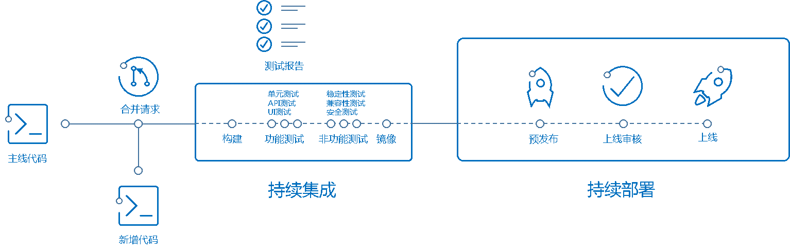
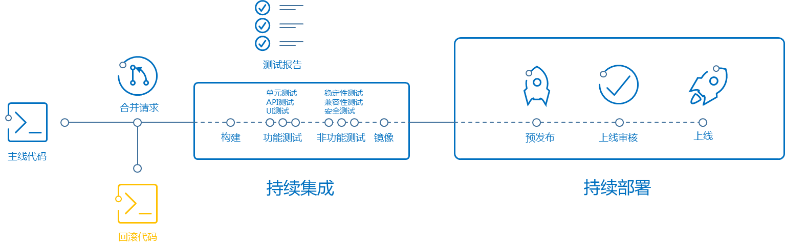
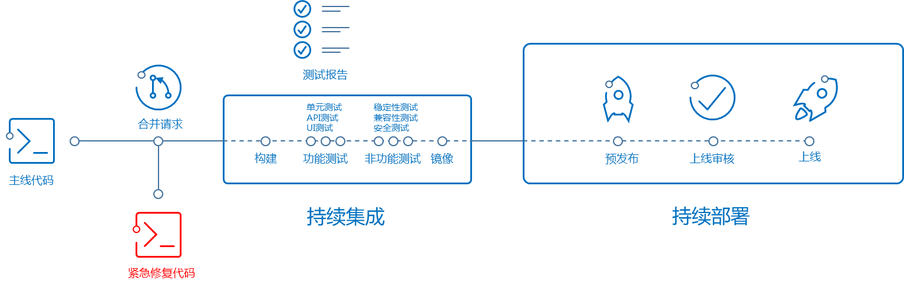

# CD-DRM-DRM-DP-L2-01-标准化部署上线流程文档

<table border="0" bordercolor="#FFFFFF">
  <tr>
    <th></th>
    <th><h1 style="font-size:150%">能力项  [部署与发布模式]</h1></th>
  </tr>
</table>

# 前言

本文档包含一般应用上线所必要的环节，其中包括资源申请、应用备案、预发布测试、正式上线等。 

# 目的

为规范系统上线管理，明确系统上线管理的工作要求，合理配置资源，确保上线能够正常完成，特制订本规范。在已开发完毕的各系统正式部署生产环境前要严格按照以下流程进行上线前检查。 

# 基本发布流程

一般应用上线需要执行以下基本流程。

## 准备工作

- 代码编写完成，已合并进入Master分支

- 已经通过自动化测试，达到质量门禁

- 已经通过人工测试，测试报告符合质量要求

- 在发布分支上配置必要的环境变量

## 代码合并

- 从Master分支向Release分支发起合并请求

- 建立新的的发布问题单，并和发布合并请求关联

## 预发布测试

- 自动化执行预发布测试

- 生成预发布测试报告，报告符合质量要求

- 生成产成品放入产成品预发布仓库

## 预发布

- 使用产品仓库预发布包自动化部署到预发布环境

## 发布审核

- 预发布人工审核（评审人填写评审意见，并同意发布）

- 检查发布文档、环境配置、环境资源、测试报告是否完备并达到要求

## 正式发布

- 产品经理合并代码到Release分支

- 自动化执行发布测试

- 生成发布测试报告，通过发布质量门禁

- 发布到生产环境

## 后续工作

- 检查发布成功

- 关闭发布问题单

# 发布失败回滚

如果上线失败或者运行出现问题，需要执行发布失败回滚操作。

## 回滚代码

- 在Release分支将代码做回滚操作（取消本次代码提交），生成新的回滚代码合并请求

- 在Release分支生成回滚问题单

## 回滚发布

执行基本发布流程代码合并到发布过程。

## 后续工作

- 检查发布成功

- 关闭回滚问题单

# 紧急补丁发布

如果需要紧急发布补丁，需要执行紧急补丁发布操作。（除非十分必要，不建议使用此流程）

## 准备工作

- 在Release分支迁出代码并进行补丁修复

- 在补丁修复分支提交代码并完成测试，达到上线质量要求

紧急补丁发布

从补丁修复分支向Release分支发起合并请求并执行基本发布流程。

## 后续工作

- 检查发布成功

- 关闭紧急补丁发布问题单