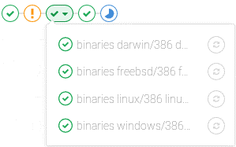
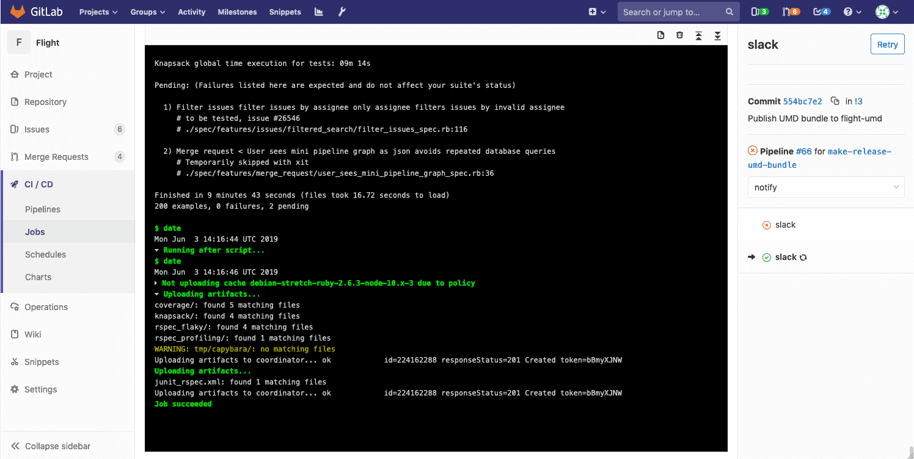

# CD-DRM-CDP-PV-L3-01-度量指标定义文档


<table border="0" bordercolor="#FFFFFF">
  <tr>
    <th></th>
    <th><h1 style="font-size:150%">能力项  [持续部署流水线]</h1></th>
  </tr>
</table>

# 前言

在当前 DevOps 的趋势下，持续集成（CI）和持续部署（CD）具有支柱性地位，搭建 CI/CD 流水线就至关重要。为了在开发团队和运营团队之间搭建桥梁，CI/CD 流水线实现了应用程序的自动构建、自动测试和自动部署。

# 目的

DevOps 是一种软件开发方法。它将持续开发、持续测试、持续集成、持续部署和持续监控贯穿于软件开发的整个生命周期。用以提高软件开发质量，并缩短软件开发生命周期。从而以达到每个公司对软件产品的期望，交付出客户最满意的产品。CI 代表持续集成（Continuous Integration），CD 代表持续交付（Continuous Delivery）和持续部署（Continuous Deployment）。也可以将它们看作是类似于软件开发生命周期的过程。整个生命周期会重复迭代，直到我们得到可以直接部署到生产环境中的代码或者产品。除此之外，在生产环境中我们还需要对代码进行度量和验证，以实时监控应用的线上运行状态。

# Gitlab流水线

Pipelines 是持续集成、交付和部署的实现组件。可以是具有许多顺序执行和并行执行作业的复杂结构。

Pipelines 包括：

- 定义要运行的作业。例如，运行代码编译或测试。

- 定义何时以及如何运行各个 Stages（阶段）。例如，测试仅在代码编译后运行。

- 如果有足够多的并发 Runners，则 Runners 并行执行同一阶段中的多个作业。

如果所有的作业都在同一个 stage 中：

  - 成功，管道进入下一 stage 阶段。

  - 失败，下一 stage 阶段没有（通常）执行，Pipelines 提前结束。

  为了更容易理解流水线的流程，GitLab 具有用于查看流水线及其状态的流水线图。

  ## 常规流水线图

常规流水线图显示每个阶段的作业名称。当您在单个流水线页面上时，可以找到常规流水线图。例如：


## 迷你流水线图

迷你流水线图占用的空间更少，可以快速通知您所有作业是否通过或出现故障。导航到以下内容时可以找到迷你流水线图：

- 流水线索引页面。

- 单个提交页面。

- 合并请求页面。

迷你流水线图允许您查看单个提交的所有相关作业以及管道的每个阶段的最终结果。这使您可以快速查看失败并修复它。

迷你流水线图中的阶段是可折叠的。将鼠标悬停在它们上方，然后单击以展开其作业。

**迷你流水线图** 									


​										 

**扩展迷你流水线图** 



# 流水线的度量

## 计算流水线持续时间

给定流水线的总运行时间不包括重试和挂起（排队）时间。

每个作业都表示为一个 Period（时期），包括：

- Period#first（当作业开始时）；

- Period#last（当作业结束时）；

举例来说：

- A任务从 1 开始到 3 结束。

- B 任务从 2 开始到 4 结束。

- C 任务从 6 开始到 7 结束。

执行状态：

```
0  1  2  3  4  5  6  7
   AAAAAAA
      BBBBBBB
                  CCCC
```

A，B 和 C 的并集是（1,4）和（6,7）。因此，总运行时间为：

​	(4 - 1) + (7 - 6) => 4

```
•	最近30次提交相应持续集成花费的时间（分钟）
•	上周的流水线
•	上个月的流水线
•	去年的流水线
```

## 流水线执行成功率

流水线执行成功率=流水线执行成功次数/流水线总数

```
总体统计数据
• 总计： 0 条流水线 
• 成功： 0 条流水线 
• 失败： 0 条流水线 
• 成功率： 100%
```

## 流水线执行日志

作业日志分为可折叠或展开的部分。

在以下示例中

- 扩展了两个部分并且可以折叠。

- 一个部分已折叠并且可以展开。

