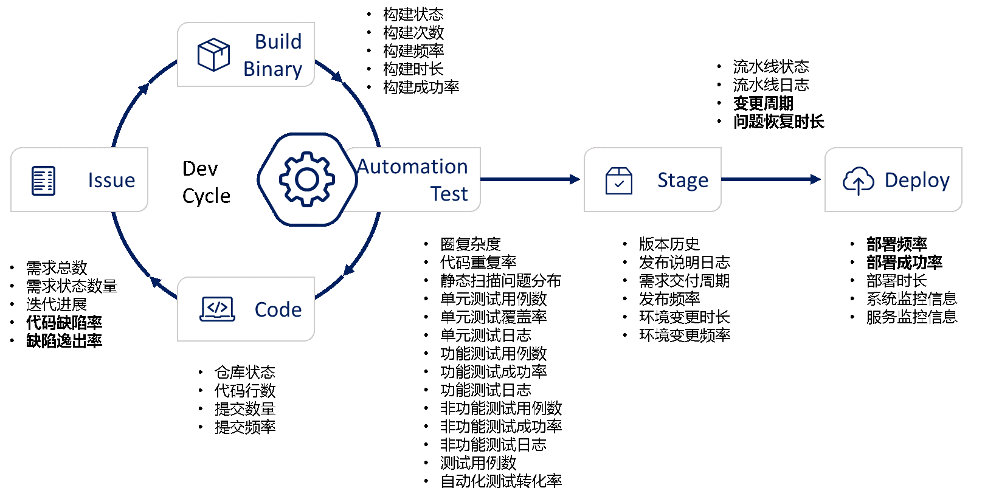

# CD-MF-MMID-L2-01-度量指标定义相关规范文档

<table border="0" bordercolor="#FFFFFF">
  <tr>
    <th></th>
    <th><h1 style="font-size:150%">能力项  [度量指标]</h1></th>
  </tr>
</table>

# 前言

度量指标(Metrics) : 指用于描述一个物体或事物的某个性质的指数、规格、标准，使其可以和其他的物体或者事物的提交。从软件的角度讲度量即把所有东西都量化、数据化、可采集。指标即表示对这些量化后的数据的目标值。维度即标识一个事物某一个侧面的一组指标。数据和度量则是帮助企业去发现DevOps转型过程中的瓶颈并且做出改进的关键基础。

# 目的

本文的目的是定义度量指标规范。

# 度量指标定义

度量指标来自软件交付过程中的各个环节。

  

​                             

| **项目管理度量**      |           |                                                              |
| --------------------- | --------- | ------------------------------------------------------------ |
| 需求总数（个）        | Gitlab    | 标记为“需求””功能增强“的总Issue数量                          |
| 需求状态数量（个）    | Gitlab    | 标记为“new””ongoing””close”的需求数量                        |
| 迭代进展              | Gitlab    | 分配在某特定Milestone中的“close”状态需求数量占比             |
| 代码缺陷率（个/KLOC） | Gitlab    | 标记为“缺陷”的Issue数量/代码行数（单位：千行）               |
| 缺陷逸出率（DER）     | Gitlab    | 生产环境缺陷数（Release Repo Issue）/总缺陷数                |
| **开发度量**          |           |                                                              |
| 仓库状态              | Gitlab    | Project/ cycle_analytics                                     |
| 代码行数（LOC）       | Gitlab    | 代码行数统计                                                 |
| 提交数量（个）        | Gitlab    | Commit数量                                                   |
| 提交频率              | Gitlab    | 单位时间内提交代码的次数：提交数量/天                        |
| **构建度量**          |           |                                                              |
| 构建状态              | Gitlab-CI | 构建步骤成功/失败状态                                        |
| 构建次数（次）        | Gitlab-CI | 构建的次数                                                   |
| 构建频率              | Gitlab-CI | 单位时间内构建的次数：构建次数/天                            |
| 构建时长（分钟）      | Gitlab-CI | 构建过程花费的时间                                           |
| 构建成功率            | Gitlab-CI | 构建成功次数/构建总次数                                      |
| **测试度量**          |           |                                                              |
| 圈复杂度              | ITP       | 方法的控制流多了一个分支，复杂度就会增加1。每个方法的最小复杂度为1。 |
| 代码重复率            | ITP       | 重复代码行数/总行数*100                                      |
| 静态扫描问题分布      | ITP       | 静态代码扫描问题及对应的代码行数                             |
| 单元测试用例数（个）  | ITP       | 编写的单元测试用例数量                                       |
| 单元测试覆盖率        | ITP       | 被单元测试覆盖到的行数/总代码行数                            |
| 单元测试日志          | ITP       | 单元测试过程日志                                             |
| 功能测试用例数（个）  | ITP       | 编写的功能测试用例数量                                       |
| 功能测试成功率        | ITP       | 1-失败的功能测试用例/总功能测试用例数                        |
| 功能测试日志          | ITP       | 功能测试过程日志                                             |
| 非功能测试用例数      | ITP       | 编写的非功能测试用例数量                                     |
| 非功能测试成功率      | ITP       | 1-失败的非功能测试用例/总非功能测试用例数                    |
| 非功能测试日志        | ITP       | 非功能测试过程日志                                           |
| 测试用例数（个）      | ITP       | 所有测试用例总数                                             |
| 自动化测试转化率      | ITP       | 自动化测试用例数/总测试用例数                                |
| **流水线度量**        |           |                                                              |
| 流水线状态            | Pipeline  | 流水线步骤执行成功或失败的状态                               |
| 流水线日志            | Pipeline  | 流水线步骤执行详细日志                                       |
| 变更周期（小时）      | Pipeline  | 需求变更流水线执行间隔                                       |
| 问题恢复时长（小时）  | Pipeline  | 从问题单提交到问题流水线成功执行的总计时间                   |
| **发布度量**          |           |                                                              |
| 版本历史              | Gitlab    | 在开发代码仓库记录的发布标记                                 |
| 发布说明日志          | Gitlab    | 在开发代码仓库发布标记所对应的发布说明日志                   |
| 需求交付周期          | Gitlab    | 从需求提交到对应需求代码发布流水线成功执行的总计时间         |
| 发布频率（小时）      | Gitlab    | 发布流水线执行间隔                                           |
| 环境变更时长（小时）  | Girlab    | 应用发布仓库环境变更触发部署流水线执行时长                   |
| 环境变更频率（小时）  | Gitlab    | 应用发布仓库环境变更触发部署流水线执行间隔                   |
| **运营度量**          |           |                                                              |
| 部署频率（小时）      | Cloud     | 应用发布仓库部署流水线执行间隔                               |
| 部署成功率            | Cloud     | 应用发布仓库部署流水线成功次数/总次数                        |
| 部署时长              | Cloud     | 应用发布仓库部署流水线执行时长                               |
| 系统监控信息          | Cloud     | 应用部署云平台系统监控信息                                   |
| 服务监控信息          | Cloud     | 应用服务部署监控信息                                         |