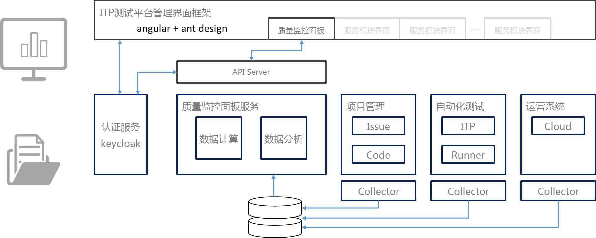
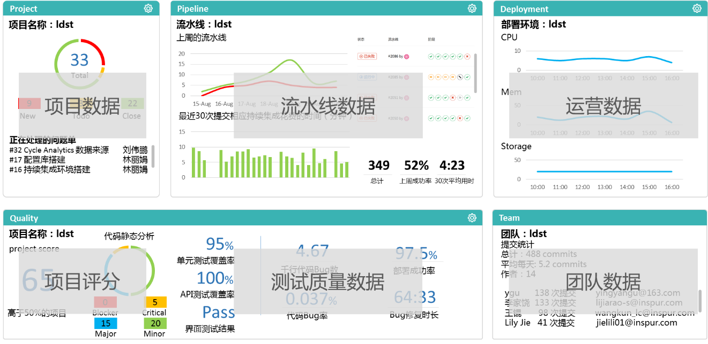

# CD-MF-MIU-L4-01-度量体系（框架）设计文档

<table border="0" bordercolor="#FFFFFF">
  <tr>
    <th></th>
    <th><h1 style="font-size:150%">能力项  [度量指标]</h1></th>
  </tr>
</table>

# 前言

度量指标(Metrics) : 指用于描述一个物体或事物的某个性质的指数、规格、标准，使其可以和其他的物体或者事物的提交。从软件的角度讲度量即把所有东西都量化、数据化、可采集。指标即表示对这些量化后的数据的目标值。维度即标识一个事物某一个侧面的一组指标。数据和度量则是帮助企业去发现DevOps转型过程中的瓶颈并且做出改进的关键基础。

# 目的

本文的目的是通过定义度量指标对软件交付过程进行优化，发现软件交付过程各个环节中存在的瓶颈并持续改进。

# DevOps度量指标

需要从两个个方面去度量DevOps能力。

·    支撑企业判定DevOps能力

·    评判软件的交付过程，并且用于发现交付瓶颈

                               

成熟的DevOps团队使用指标驱动的计分卡或仪表板来跟踪进度并推动持续改进。这些指标通常支持对软件开发生命周期（Software Development Lifecycle: SDLC）进行改进的两个主要类别：速度和质量。目前度量企业DevOps能力的关键指标包括：

·    吞吐量指标：部署频率，变更交付周期。

·    稳定性指标：变更失败率，问题平均恢复时长（mean time to recover）。

吞吐量即敏捷性，确保企业能够适应市场的变化，并且快速做出反馈。稳定性，即高质量。对于持续提升软件产品内在交付质量， 还需要增加相应的质量指标：

·    质量指标代码缺陷率，缺陷逸出率。

与所有DevOps一样，目标是使一切自动化并让系统完成工作，从而提高性能。接下来是一些指标指南，建议团队将其作为安全DevOps准则的一部分。

## 速度维度

DevOps旨在缩短发布周期，以更快地将移动应用程序更新交付用户。 无论目标是每周，每天甚至每天多次发布应用程序， 这里有一些与速度有关的关键指标。

## ·    循环时间值（Cycle Time Value: CTV）

CTV是指从提交/构建到生产所需的时间，涵盖构建，测试，等待和发布到生产的所有步骤。

**实践经验:**

通过最后一刻的安全测试和/或冗长的安全评估来缩短周期，这会给开发人员和组织间造成矛盾。 随着DevOps团队向三个小时或更短的时间CTV目标进行改进，安全指标通常会造成最大的延误。 因为仅仅手动测试就需要数小时，数天甚至数周的时间。 在周期中自动执行安全测试越早越好。 如有必要，中断构建，而是专注于自动对新代码进行安全测试，同时建议每天构建减少CTV并消除人为错误。

## ·    平均解决时间（Mean Time to Resolve: MTTR）

从DevOps角度来讲，采用MTTR衡量解决问题所需的时间，无论是事件，功能性错误还是安全性错误。

**实践经验:**

时间就是金钱！浪费时间在误报或复杂问题上，这些问题很难找到并找到解决方案。会使开发团队感到沮丧，并使花费宝贵的机器资源。建议通过测试工具，找出安全漏洞的位置并提供修复说明，以便快速进行修复。

## ·    驻留时间值（Dwell Time Value: DTV）

在DevOps世界中，DTV是在漏洞被发现和修复之前额外花费的时间。花费的时间越长，被黑客造成的损害可能就越大。

**实践经验:**

驻留时间与缺陷逸出率（Defect Escape Rate: DER）直接相关，如下所述。每个逃脱的安全漏洞都会成为扩大攻击的媒介，从而可能导致巨大的问题。在安全测试中采用简化方式来进行紧急发布会增加风险。更糟糕的是，每年只对一个发布进行测试，这意味着每个包含新代码的发布都可能面临未被发现的漏洞风险。定期进行连续的安全测试可减少出现漏洞的可能性，并加快找到解决方案以缩小DTV。

## 质量控制

DevOps组织需要在速度与质量之间取得平衡，软件交付团队中的每个人都需要对质量和速度做出贡献，否则再快的速度也没有意义。以下是一些针对质量的指标。

## ·    错误率值（Error Rate Value: ERV）

错误率一般是指每行代码的错误或漏洞数量。

**实践经验:**

为了提供高质量的软件，DevOps组织力求减少错误，以保持最佳的生产率。各个级别的自动化工具都减少了人为错误和技术差距。为开发人员提供安全培训并每天自动编译测试新增的代码可以最大程度地降低错误率，并有助于持续改进。

## ·    缺陷逃逸率（Defect Escape Rate: DER）

DER跟踪有多少缺陷和错误进入生产环境。

**实践经验:**

在Bug进入生产环境前，更容易对其进行修复，而且成本也较低。 IBM研究表明，修复生产中的错误要比在开发中发现错误要花费100倍的成本。当人们依赖于每次发布执行一次的手动测试而不是自动安全测试时，缺陷率往往很高。对DER进行归零有助于评估安全测试程序的有效性。

# Dashboard

Dashboard是DevOps常用的功能，整个项目开发周期都离不开它，从需求划分、任务分配、功能实现到测试上线都需要Dashboard的协助，Dashboard使抽象工作流程可视化，让项目管理者能更清晰的掌握项目进度。持续的获取过程有效性数据和质量有效性数据为团队提供可视化Dashboard。

建立快速准确的看板可以帮助团队带来以下的益处：

·    开发到运维的工作快速的从右向左的流动（流动原则）

·    从右向左的每一个阶段中，应用持续、快速的工作反馈机制（反馈原则）

·    建立具有创意和高可信度的企业文化，支持动态的、严格的、科学的实验（持续学习与实验原则：它打造出一种高度信任的文化和一种科学的工作方式）

## 数据收集展现架构

     

**agile项目管理**

Dashboard可将DevOps团队的工作项目可视化，以优化agile项目中的工作流程。Dashboard的设计应能够最大程度地提高团队协作效率，可视化工作并提供灵活的视图，就像我们以前在白板上使用便笺来共享项目进度，问题和积压工作一样。

看板盘使DevOps团队可以创建卡，标签，分配和列，以连续交付agile项目。

燃尽图在指定时间段内可视化未完成的工作或积压的工作，并提供团队的当前速度和轨迹，这些指标通常用于agile和DevOps项目管理中。

还允许团队在整个上下文中确定个人和团队任务的优先级；提供可见性以查看，报告和跟踪正在进行的工作；并帮助提高团队绩效。

**集成/测试监控**

开发人员负责改善应用程序和服务的性能以及开发新功能。集成/测试监控使开发人员能够在持续集成/持续开发（CI / CD）流程中尽快产生错误修正，增强功能并发布安全补丁。这些Dashboard还应可视化流水线及质量信息。

 

**DevOps平台监控**

结合了各种技术和工具来在云或本地中构建DevOps平台。Linux容器管理工具（例如Kubernetes和OpenShift）是成功的DevOps平台的基础。这是因为Linux容器的不变性和可移植性使其可以更快，更轻松地从应用程序开发转移到生产中的构建，测试和部署。

DevOps平台观察仪表盘使运维团队能够通过收集来自机器或节点故障和服务错误的数字时间序列数据，来协调应用程序容器和软件定义的基础架构，例如网络（SDN）和存储（SDS）。未来Dashboard还可视化多维数据格式和查询数据模式。

Jaeger使开发人员能够跟踪请求的数量，每个请求的响应时间等等。它还使用Istio服务网格改善了对分布式网络系统上的云原生应用程序的监视和跟踪。

## Dashboard数据来源和展现

         

**项目数据**

数据来源：

Gitlab

**流水线数据**

数据来源：

Gitlab-CI

**运营数据**

数据来源：

部署环境

**测试质量数据**

数据来源：

Sonarqube、Gitlab、Gitlab-CI

**团队数据**

数据来源：

Gitlab

**项目评分**

数据来源：

综合