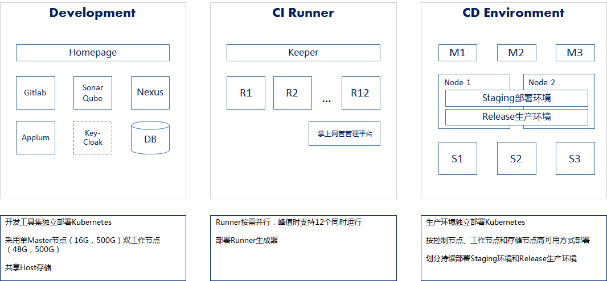
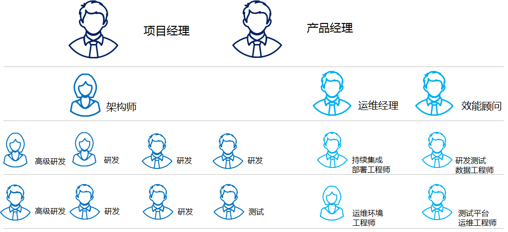
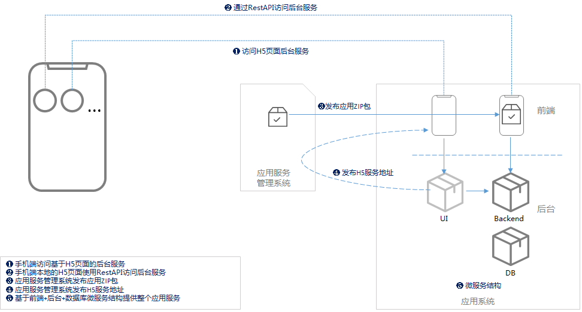
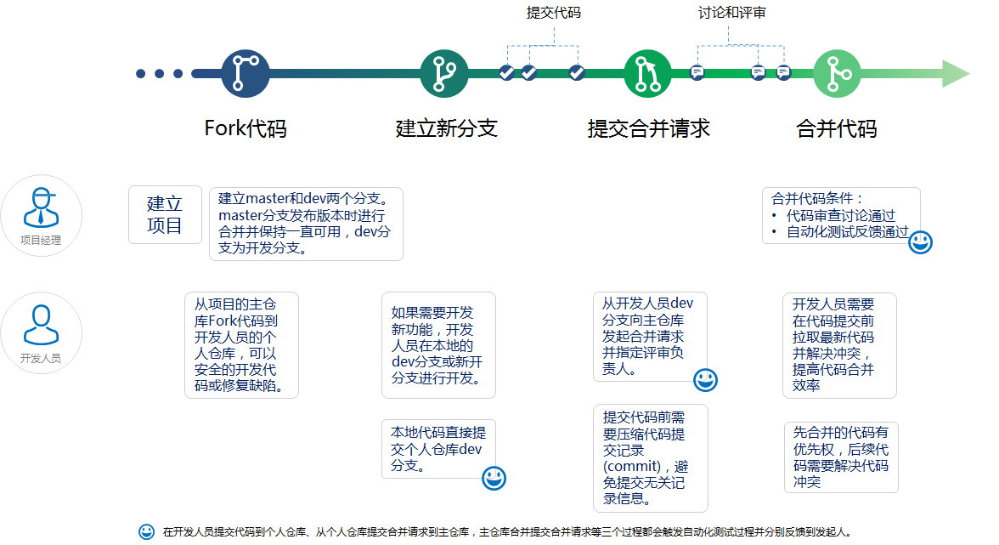
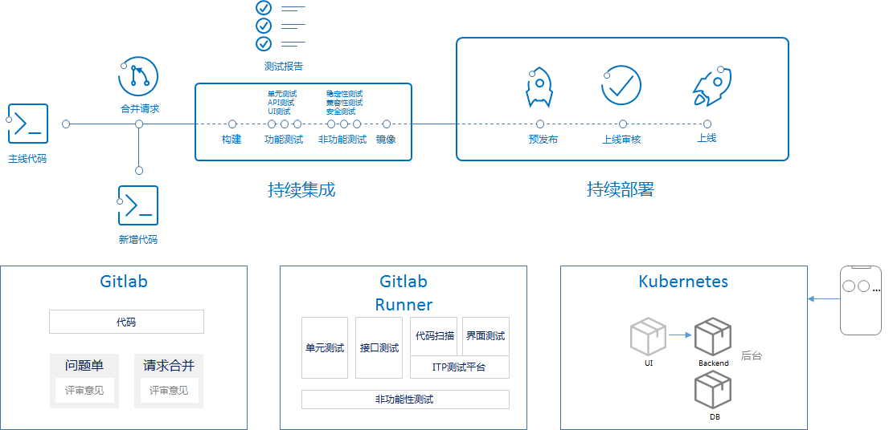
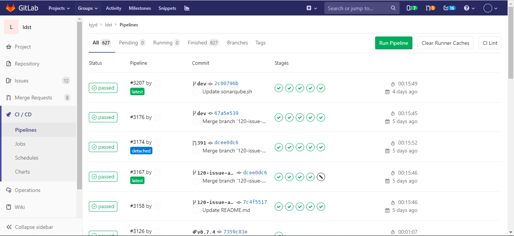
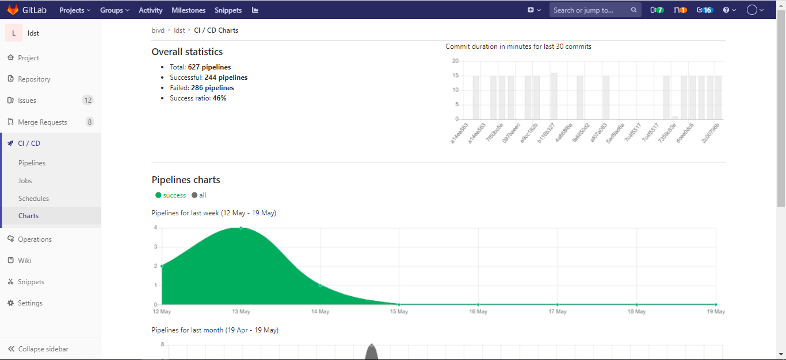
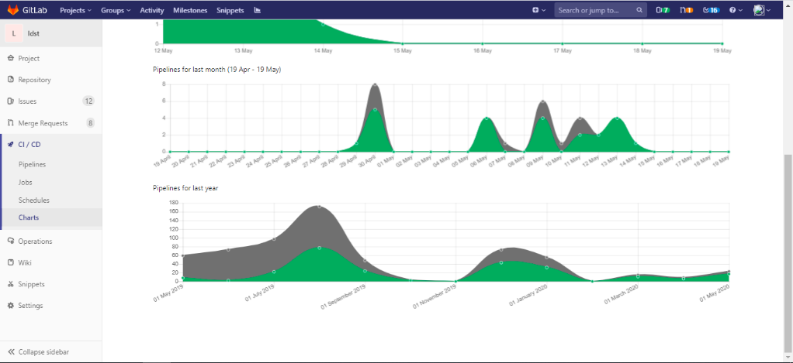
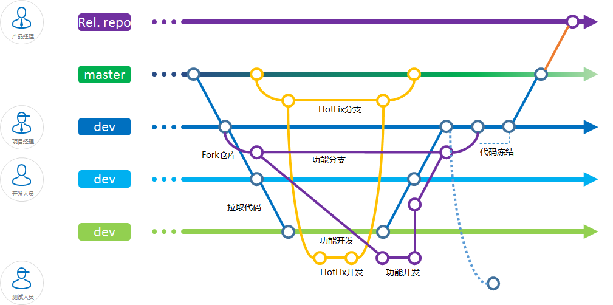

# 研发运营一体化（DevOps）能力成熟度评估主体信息登记表

 

| **企业基本信息**             |                                                              |
| ---------------------------- | ------------------------------------------------------------ |
| **评估企业名称**             |                                                              |
| **三证合一的营业执照**       |                                                              |
| **参评项目基础信息**         |                                                              |
| **评估项目名称**             | XXXXXX系统                                                   |
| **参评项目简介**             | 该项目是一个微服务的业务系统，包含信息列表、评分、管理等，主要服务于外部用户群体。项目发布周期为每周1次 |
| **参评项目生产环境信息**     | 12台服务器，400个容器，15个应用。用户规模百万级。  |
| **参评项目所在组织信息**     | 18人，PM:2人，Developer:9人，效能团队：7人    |
| **参评项目架构               |  1手机端访问基于H5页面的后台服务   2 手机端本地的H5页面使用RestAPI访问后台服务   3 管理系统发布应用ZIP包   4 管理系统发布H5服务地址   5 基于前端+后台+数据库微服务结构提供整个服务 |
| **参评项目的研发与交付流程** | 发布周期：每周一次发布。  迭代周期：1周。     |
| **参评项目的交付工具链**     | 数据库：MySQL  开发编码工具（IDE）：VSCode 需求管理工具：Gitlab Issue 计划与任务管理工具: Gitlab 代码管理工具：Gitlab  构建工具：Maven, Docker  制品管理工具：Nexus 持续集成与流水线工具：Gitlab CI  自动化测试工具：JUnit, Tarven, Appium  代码扫描工具： SonarQube  部署工具：Docker,  docker-compose, Kubernetes  度量与报表工具：Gitlab, Prometheus,  Dashboard |
| **参评项目的流水线现状**     |    |
| **参评项目的分支模型及介绍** |     |
| **参评项目的环境分类**       | 开发：由单一源构建平台构建出虚拟机环境。 测试：由单一源构建平台构建出虚拟机环境。 预发布：Kubernetes容器   生产：容器云平台 |
| **研发与交付效能关键数据**   | 迭代周期：每周 发布上线的频率：每天多次 部署失败率：2% |
| **项目相关工程效率团队构成** | 工程效率团队成员5人：   经理1人，架构师1人，研发2人，配置管理1人。 |

 