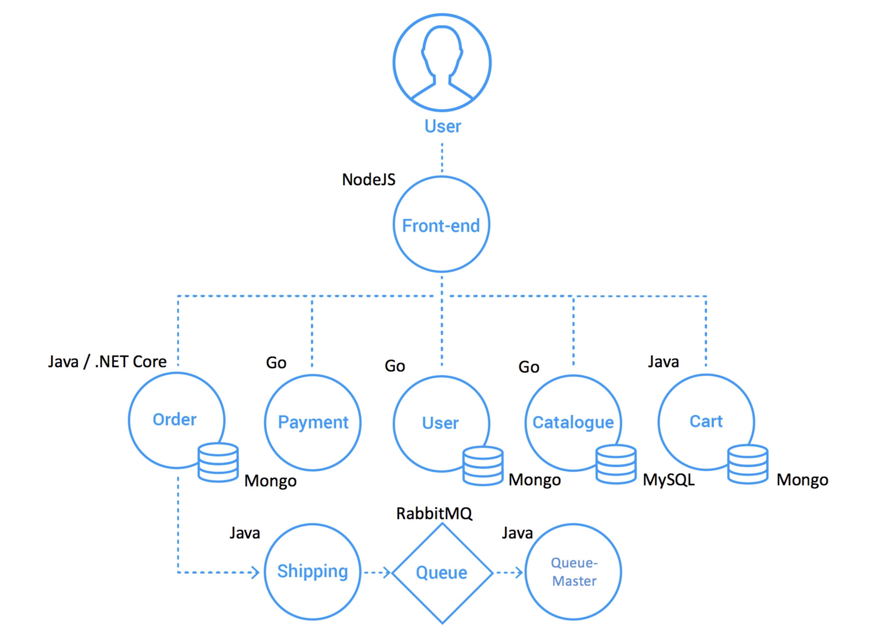
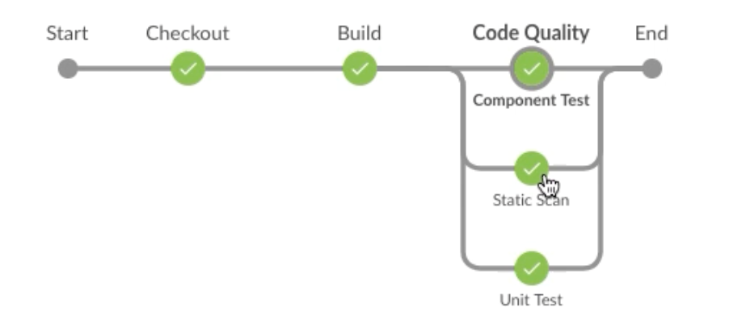

# 研发运营一体化（DevOps）能力成熟度评估主体信息登记表

 

| **企业基本信息**             |                                                              |
| ---------------------------- | ------------------------------------------------------------ |
| **评估企业名称**             | 请填写企业名称（和工商登记信息一致）                         |
| **三证合一的营业执照**       | 营业执照、组织机构代码证和税务登记证三证合一的执照（请以PDF的方式提供），用于制作评估证书 |
| **参评项目基础信息**         |                                                              |
| **评估项目名称**             | 请填写参评项目名称（该项目名称会展现在评估证书中）           |
| **参评项目简介**             | 请填写参评项目简介，比如主要功能，应用场景，发布周期         |
| **参评项目生产环境信息**     | 请填写参评项目生产环境下服务器或容器数量、用户规模（如：十万级，百万级，不用具体数量）、并发用户数等 |
| **参评项目所在组织信息**     | 请填写参评项目所在组织（部门或团队）的信息，包括：人数规模，各角色人数分布（PM、研发、测试、运维），外包团队也算在内 |
| **参评项目架构**             | 请填写参评项目的软件架构图，以判断架构耦合程度               |
| **参评项目的研发与交付流程** | 请采用文字和流程图等简述项目发布周期，迭代周期，从需求收集与分析到编码、集成、部署、测试、发布（生产环境）的过程及审批环节等信息，以判断流程是否合理顺畅 |
| **参评项目的交付工具链**     | 请填写参评项目所采用工具链，如果是自研工具请注明。包括：  技术栈：如Spring Boot等），请说明数据库  开发编码工具（IDE）：如Eclipse等  需求管理工具：如JIRA\Redmine等  计划与任务管理工具：如JIRA等  代码管理工具：如Gitlab/SVN等  构建工具：如Maven/Ant等  制品管理工具：如Nexus/Artifactory  持续集成与流水线工具：如Jenkins等  自动化测试工具：如RobotFramework\Jmeter,Selenium,Junit4等  代码扫描工具：如SonarQube等  部署工具：如Ansible等  度量与报表工具：如Tableau等 |
| **参评项目的流水线现状**     | 请截取流水线的效果图或填入流水线的逻辑设计图，如果流水线分级，请将不同级别的流水线均填入该单元格 |
| **参评项目的分支模型及介绍** | 分支模型图；  请对各分支用途进行介绍，如：开发提交、测试、发布等 |
| **参评项目的环境分类**       | 请填写参评项目的环境分类情况，包括开发、测试、预发布、生产环境等分类  请说明各环境的基础设施技术（如：实体机、OpenStack虚拟机、Kubernetes容器、Cloud Foundry等） |
| **研发与交付效能关键数据**   | 迭代周期：如双周，一个月，如果周期内有明确的开发、SIT、UAT等划分，请说明各阶段的耗时  发布上线的频率：如：每天一次或多次，一个月一次等  部署失败率：如2% |
| **项目相关工程效率团队构成** | 请说明是否存在如工程效率、配置管理、发布管理等类型的团队支持该项目的持续交付改进，包括实践的落地和工具的提高等，请说明团队人数和各自负责内容 |

 

 

## **样例表**

| **企业基本信息**             |                                                              |
| ---------------------------- | ------------------------------------------------------------ |
| **评估企业名称**             | A公司软件中心                                                |
| **三证合一的营业执照**       | 营业执照、组织机构代码证和税务登记证三证合一的执照（请以PDF的方式提供），用于制作评估证书 |
| **参评项目基础信息**         |                                                              |
| **评估项目名称**             | 新一代电子商务系统                                           |
| **参评项目简介**             | 该项目是我公司核心业务系统，包含商品管理、订单管理、支付管理等，主要服务于我公司核心客户群体。项目发布周期为每周2次 |
| **参评项目生产环境信息**     | 该项目生产环境共1000个容器，用户规模为千万级                 |
| **参评项目所在组织信息**     | 该项目由软件中心开发一部负责，本部门共计24人，1名产品经理，16名开发，4名测试，2名UE，1名应用运维,其他10名开发由外包团队构成 |
| **参评项目架构**             | 该项目采用微服务架构   |
| **参评项目的研发与交付流程** | 该项目采用敏捷开发模式，迭代周期是两周一个迭代。  研发与交付流程包括：需求收集->需求设计->待开发->开发中->待测试验证->待发布->已发布   |
| **参评项目的交付工具链**     | 技术栈：Spring Boot、NodeJS以及Go语言，数据库采用MySQL和MongoDB两种  开发编码工具（IDE）：IntelliJ IDEA CE  需求管理工具：JIRA  计划与任务管理工具：JIRA  代码管理工具：Gitlab CE  构建工具：Maven  制品管理工具：Nexus和Harbor  持续集成与流水线工具：Jenkins2.0  自动化测试工具：RobotFramework,Junit4  代码扫描工具：SonarQube和Fortify  部署工具： 基于Ansible自研平台  度量与报表工具：暂无 |
| **参评项目的流水线现状**     | 提交阶段流水线  验收阶段流水线  |
| **参评项目的分支模型及介绍** | 分支模型图；  Feature分支每个特性都会有一个，用于特性开发  Master分支用于集成和测试验证，属于主干分支  Release分支为发布分支，对应线上，Hotfix修改也在该分支上完成 |
| **参评项目的环境分类**       | 该项目分为开发环境、SIT测试环境、UAT验收测试环境、预发布环境（环境）、生产环境  都是采用Kubernetes容器作为基础设施基础技术 |
| **研发与交付效能关键数据**   | 迭代周期：2周  发布上线的频率：2周一次，每个迭代的周五晚上上线  部署失败率：5% |
| **项目相关工程效率团队构成** | 目前该项目的持续交付由公司级的配置管理组负责导入实践和提供Jenkins、Gitlab等工具支持，配置管理组共5人。1人负责Gitlab，1人负责Jenkins，1人负责SonarQube，2人负责平台开发 |

 